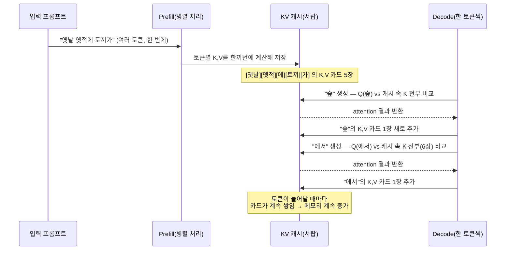

# KV 캐시(KV Cache)에 대해서 설명해줘

## 결론부터

KV 캐시는 **"이 단어가 나오기까지, 앞에 나온 모든 단어들에 대해 이미 계산해둔 Key/Value 벡터를 다시 계산하지 않고 재사용하기 위해 저장해두는 메모리"**예요. 트랜스포머는 단어를 하나 만들 때마다 **문장 맨 앞부터 지금까지 나온 모든 토큰**과 비교(attention)를 해야 하는데, 이걸 매번 처음부터 다시 계산하면 문장이 길어질수록 계산량이 **제곱(O(t²))**으로 폭발해요. KV 캐시는 "한 번 계산한 결과는 서랍에 넣어두고 다음번엔 새로 생긴 것만 계산"하는 방식으로 이 비용을 **선형(O(t))**으로 낮춰주는 대신, 그 대가로 **문맥이 길어질수록 계속 커지는 GPU 메모리**를 요구해요. [이전 답변](../llm-inference-vram-weights-vs-input-memory.md)에서 "가중치 옆에서 계속 자라나는 서랍"이라고 부른 게 바로 이거예요.

## 다섯 살에게 설명하듯

이야기를 이어서 만드는 놀이를 한다고 생각해보세요. "옛날 옛적에 토끼가 숲에서..." 다음 단어를 맞힐 때마다, **지금까지 나온 모든 문장을 처음부터 다시 읽고** 각 단어가 무슨 뜻이었는지, 다른 단어랑 어떻게 관련되는지 새로 계산한다면 너무 느리겠죠?

그래서 똑똑한 방법을 써요. 단어가 하나 나올 때마다, 그 단어에 대해 "이 단어는 이런 뜻(Value)이고, 다른 단어들이 날 찾을 때 이런 이름표(Key)로 찾으면 돼"라는 **메모 카드**를 한 장 만들어서 서랍(KV 캐시)에 넣어둬요. 다음 단어를 만들 땐 **서랍에 있는 카드는 그대로 재사용**하고, **방금 새로 나온 단어의 카드 딱 한 장만** 새로 만들어서 서랍에 추가해요. 문장이 길어질수록 서랍 속 카드가 계속 늘어나는데, 이게 바로 "KV 캐시가 문맥 길이에 비례해서 커진다"는 말의 정체예요.

## 기술적으로 풀어보면

### 1. K, V, Q가 뭐고 왜 캐시하는 건 K와 V뿐인가

어텐션(attention)은 각 토큰마다 3개의 벡터를 만들어요.

- **Q(Query, 질문)**: "나(지금 토큰)랑 관련 있는 게 어디 있지?" — 찾으러 다니는 역할
- **K(Key, 이름표)**: "나는 이런 특징을 가진 토큰이야" — 다른 토큰이 날 찾을 때 대조하는 이름표
- **V(Value, 실제 내용물)**: "나를 찾았다면, 실제로 가져갈 내용은 이거야"

계산식은 `Attention(Q, K, V) = softmax(QKᵀ/√d) V`예요. 여기서 **Q는 "지금 이 순간 새로 생성 중인 토큰"에 대해서만 필요**하고, **K와 V는 "과거의 모든 토큰"에 대해 다 있어야** 계산이 돼요. 즉 새 토큰을 만들 때마다 과거 토큰들의 Q는 아예 쓸 일이 없어요(이미 그 토큰들 차례에서 자기 역할을 다 했으니까). 그래서 **재사용할 가치가 있는 건 K와 V뿐**이고, 이게 이름의 유래예요.

### 2. Prefill과 Decode — 캐시가 채워지는 시점이 다르다

LLM 추론은 보통 두 단계로 나뉘어요.

- **Prefill(프리필) 단계**: 사용자가 입력한 프롬프트 전체(예: 2,000 토큰)를 **한 번에 병렬로** 통과시키면서, 그 안의 모든 토큰의 K/V를 한꺼번에 계산해 캐시에 채워요. 여기선 GPU가 행렬 곱셈을 크게 한 방에 처리하니까 상대적으로 빨라요.
- **Decode(디코드) 단계**: 답변을 한 토큰씩 만들 때마다, **방금 만든 토큰 하나**의 K/V만 새로 계산해서 캐시에 한 줄 추가하고, attention 계산 시엔 **캐시에 쌓인 전체 K/V**를 다시 불러와 사용해요. 토큰 하나 만들 때마다 이 과정을 반복해요.

즉 "느리게 한 단어씩" 생성되는 이유 중 하나가, decode 단계에서는 매 스텝마다 GPU가 (작은 계산량 대비) **캐시 전체를 메모리에서 읽어와야** 해서 계산보다 메모리 대역폭이 병목이 되기 때문이에요.

### 3. 왜 이 캐시가 "공짜"가 아닌가 — 메모리 폭증 문제

캐시 크기는 대략 이렇게 늘어나요.

```
KV 캐시 크기(byte) ≈ 2(K,V) × 레이어 수 × KV헤드 수 × 헤드차원 × 정밀도(byte) × 지금까지의 토큰 수
```

여기서 핵심은 **"지금까지의 토큰 수"에 정비례**한다는 점이에요. 대화가 짧으면 무시할 만하지만, 수만~수십만 토큰짜리 긴 문서/긴 대화에서는 이 값이 모델 가중치 크기(고정값)를 넘어설 수도 있어요. 그래서 "동시에 몇 명의 사용자를 처리할 수 있는가(배치 크기)"도 결국 **가중치 크기가 아니라 KV 캐시가 GPU 메모리를 얼마나 남겨두느냐**로 정해지는 경우가 많아요.

### 4. 그래서 나온 대응 기술들

| 기법 | 아이디어 | 트레이드오프 |
|---|---|---|
| **GQA(Grouped-Query Attention)** | 여러 개의 Query 헤드가 **적은 수의 K/V 헤드 그룹을 공유** — 캐시할 K/V 자체를 줄임 | 캐시 4~8배 절감, 품질 손실 적음 — Llama 3 등 최신 모델 다수 채택 |
| **MQA(Multi-Query Attention)** | 모든 Query 헤드가 **K/V를 딱 1세트만 공유** — GQA보다 더 공격적 | 캐시 절감 폭 최대, 품질 손실은 GQA보다 큼 |
| **MLA(Multi-head Latent Attention)** | K/V를 저차원(latent)으로 압축해서 저장하고 필요할 때 복원 | DeepSeek 계열이 채택, 캐시를 크게 줄이면서 품질 유지 시도 |
| **Sliding Window Attention** | 최근 W개 토큰의 K/V만 남기고 오래된 건 버림(예: Mistral 7B의 4096 윈도우) | 메모리는 고정되지만, 윈도우 밖의 아주 오래된 문맥은 못 봄 |
| **PagedAttention(vLLM 등)** | 캐시를 OS의 가상메모리처럼 고정 크기 블록 단위로 나눠 필요할 때만 할당 | 메모리 낭비를 60~80%에서 4% 이하로 줄여 동시 처리량↑ (캐시 총량 자체를 줄이진 않음) |
| **KV 캐시 양자화(Quantization)** | K/V를 가중치보다 낮은 정밀도(예: 8bit, 심지어 3bit)로 저장 | attention의 softmax가 반올림 오차를 어느 정도 평균화해줘서 정확도 손실이 비교적 적음 |

## 요약 그림



## 요약

- KV 캐시는 **과거 토큰들의 Key/Value를 재사용하기 위한 저장 공간**이고, 덕분에 매 토큰 생성 비용이 O(t²) → O(t)로 줄어요.
- 하지만 그 대가로 **문맥 길이에 정비례해서 GPU 메모리를 계속 잡아먹어요** — 이게 "긴 대화/긴 문서일수록 VRAM이 부족해지는" 진짜 이유예요.
- 이를 줄이기 위해 GQA/MQA/MLA(캐시할 K/V 자체를 줄이기), Sliding Window(오래된 캐시 버리기), PagedAttention(메모리 낭비 줄이기), 양자화(정밀도 낮춰 저장하기) 같은 기법들이 실무에서 조합되어 쓰여요.

Sources:
- [What Is KV Cache in LLMs? A 2026 Guide — buildfastwithai.com](https://www.buildfastwithai.com/blogs/kv-cache-llms-explained)
- [KV Cache Optimization: Serve 10x More Users per GPU (2026) — Spheron Blog](https://www.spheron.network/blog/kv-cache-optimization-guide/)
- [KV Cache Engineering for LLM Serving — Daily Dose of DS](https://blog.dailydoseofds.com/p/kv-cache-engineering-for-llm-serving)
- [KV Cache Optimization: Memory Efficiency for Production LLMs — Introl Blog](https://introl.com/blog/kv-cache-optimization-memory-efficiency-production-llms-guide)
- [KV Cache Optimization via Multi-Head Latent Attention — PyImageSearch](https://pyimagesearch.com/2025/10/13/kv-cache-optimization-via-multi-head-latent-attention/)
- 이 저장소 내 관련 답변: [`llm-inference-vram-weights-vs-input-memory.md`](../llm-inference-vram-weights-vs-input-memory.md) (가중치·활성화·KV 캐시로 나눈 VRAM 구성 전체 그림)
