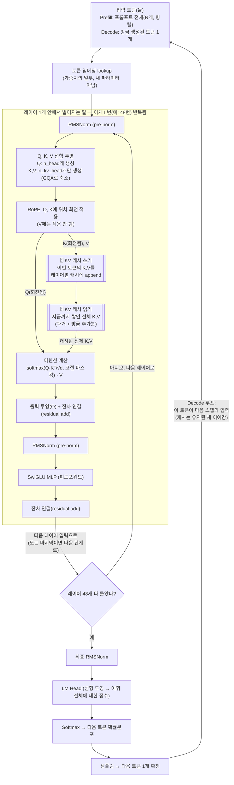

# KV 캐시가 현대적 LLM의 연산 과정에서 실제로 어떻게 계산되는지 mermaid로 flow를 보여줘

## 결론부터

요즘(Llama/Qwen 계열) LLM 한 레이어 안에서 KV 캐시가 만들어지는 순서는 **"정규화 → Q/K/V 투영(이때 K/V는 GQA로 Q보다 적은 개수만 생성) → Q/K에 RoPE로 위치 회전 적용 → 방금 만든 K,V를 캐시에 저장 → 캐시에 쌓인 전체 K,V로 어텐션 계산"**이에요. 핵심은 **"이번 토큰의 K,V를 계산 → 캐시에 넣기 → 캐시 전체를 가지고 어텐션"**이라는 순서가 모든 레이어마다, 모든 토큰마다 반복된다는 점이고, 이게 [이전 답변](./kv-cache-attention-explained.md)에서 설명한 "카드를 서랍에 넣고 다음번엔 서랍 전체를 훑어본다"는 비유의 실제 연산 버전이에요.

## 다섯 살에게 설명하듯

말하기 게임을 다시 떠올려 보세요. 이번엔 "카드를 만드는 공장"이 어떻게 돌아가는지 자세히 볼게요.

1. 새 단어(토큰)가 들어오면, 먼저 "옷매무새를 가다듬어요"(정규화, RMSNorm).
2. 그다음 이 단어를 3가지 색깔 안경(Q, K, V)으로 각각 다시 봐요. 그런데 **"질문 안경(Q)"은 여러 개 만들면서, "이름표 안경(K)"이랑 "내용물 안경(V)"은 훨씬 적게 만들어요**(GQA — 여러 명이 이름표 하나를 같이 써요, 서랍을 아끼려고).
3. 만든 이름표(K)와 질문(Q)에는 "몇 번째 자리인지" 도장을 돌려서 찍어요(RoPE 회전).
4. **이름표(K)와 내용물(V) 카드를 서랍(캐시)에 넣어요.** 질문(Q)은 서랍에 안 넣어요 — 지금 이 순간에만 쓰고 버려요.
5. 서랍에 있는 **모든** 이름표 카드와 지금 질문을 대조해서, "누구랑 제일 관련 있는지" 점수를 매기고(소프트맥스), 그 점수만큼 서랍 속 내용물(V)들을 섞어서 답을 만들어요.
6. 이 답을 가지고 "생각 정리"(SwiGLU라는 이름의 MLP)까지 마치면 한 레이어 끝. 이걸 레이어 수만큼(예: 48번) 반복해요.
7. 맨 마지막에 "다음 단어는 뭘까"를 확률로 뽑아서 한 단어를 골라요. 그 단어가 다음번엔 다시 1번부터 이 공정을 타요 — 단, **서랍(캐시)은 안 비우고 그대로 이어가요.**

## 기술적으로 풀어보면

### 1. 프리필(Prefill) vs 디코드(Decode)에서 이 flow가 어떻게 다르게 도는가

- **Prefill**: 프롬프트의 모든 토큰(예: 2,000개)이 **한 번에 병렬로** 이 flow를 통과해요. 그 결과 2,000개 토큰 전부의 K,V가 캐시에 한꺼번에 채워져요.
- **Decode**: 새로 생성된 토큰 **딱 1개**만 이 flow를 통과해요. Q도 1개, 새로 계산되는 K,V도 1개(레이어당)뿐이지만, 어텐션 계산 시엔 **캐시에 쌓인 과거 전체**(2,000개 + 지금까지 생성된 것)를 다 끌어와서 비교해요.

아래 다이어그램은 이 두 모드가 **레이어 내부 로직은 완전히 동일**하고, 다만 "몇 개의 토큰이 한 번에 들어오는가"만 다르다는 걸 보여줘요.

### 2. mermaid flow

### 3. 그림에서 눈여겨볼 3가지

- **Q는 캐시에 안 들어간다**: 그림에서 `ROPE` 다음 화살표가 두 갈래로 갈라지는데, Q는 곧장 `ATTN`으로 가고 K,V만 `WRITE`(캐시 저장)로 가요. Q는 "이번 순간에만 필요한 질문"이라 저장할 이유가 없어요.
- **RoPE는 저장되기 전에 적용된다**: 그림처럼 캐시에 넣는 K는 이미 회전(위치 정보 주입)이 끝난 상태예요. 이렇게 저장해두면 나중에 다시 회전시킬 필요 없이 바로 어텐션에 쓸 수 있어서 대부분의 기본 구현이 이 방식(post-RoPE 캐싱)을 써요. (다만 캐시를 양자화(quantization)해서 더 압축하려는 최신 기법들은 일부러 **회전 전(pre-RoPE) K를 저장**해뒀다가 필요할 때 즉석에서 회전시키기도 해요 — 회전 전 값이 채널별 분포가 더 고르게 유지돼서 압축이 잘 되기 때문이에요.)
- **GQA는 `PROJ` 단계에서 이미 반영된다**: K,V 헤드 수를 Q보다 줄이는 GQA는 그림의 `PROJ`(선형 투영) 단계에서 애초에 더 적은 개수로 만들어버리는 거예요. 그러니 캐시(`WRITE`)에 저장되는 양도 자동으로 줄어들어요 — 이게 [지난 답변](./kv-cache-vs-weight-size-quadratic-linear-scaling.md)에서 말한 "GQA가 캐시를 줄인다"의 실제 위치예요.

## 요약

- KV 캐시는 레이어마다 "K,V 계산 → 회전(RoPE) → 캐시에 쓰기 → 캐시 전체 읽어서 어텐션"이라는 4단계 흐름의 일부로 만들어지고, 이게 레이어 수만큼(예: 48번) 반복돼요.
- Prefill은 이 flow를 여러 토큰에 대해 병렬로 한 번에 돌려 캐시를 채우고, Decode는 토큰 1개씩 이 flow를 반복하며 캐시에 한 줄씩 추가해요.
- Q는 캐시되지 않고, K는 보통 RoPE 회전이 끝난 뒤의 값으로 캐시되며, GQA는 애초에 캐시에 쓸 K,V의 개수 자체를 줄이는 지점이에요.

Sources:
- [Modern Open-Source LLM Architecture Explained: Transformer, RoPE, SwiGLU, GQA, GRPO and Beyond — nandigamharikrishna.substack.com](https://nandigamharikrishna.substack.com/p/modern-open-source-llm-architecture)
- [How Large Language Models Work: The Complete Technical Guide (2026) — starmorph.com](https://blog.starmorph.com/blog/how-llms-work-complete-technical-guide)
- [EliteKV: Scalable KV Cache Compression via RoPE Frequency Selection and Joint Low-Rank Projection (arXiv)](https://arxiv.org/abs/2503.01586)
- [A²ATS: Retrieval-Based KV Cache Reduction via Windowed Rotary Position Embedding (arXiv)](https://arxiv.org/pdf/2502.12665)
- 이 저장소 내 관련 답변: [`kv-cache-attention-explained.md`](./kv-cache-attention-explained.md), [`kv-cache-vs-weight-size-quadratic-linear-scaling.md`](./kv-cache-vs-weight-size-quadratic-linear-scaling.md), [`04-self-attention.md`](../llm-architecture/04-self-attention.md), [`03-positional-encoding.md`](../llm-architecture/03-positional-encoding.md)
