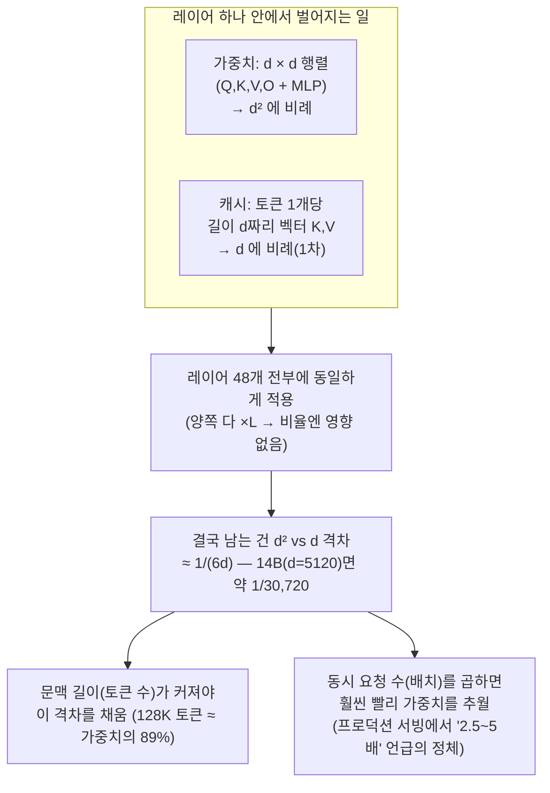

# 레이어가 많은데, 14B 예시에서 KV 캐시가 2~3배로 안 불어나는 이유는?

## 결론부터

"레이어가 많으니까 그만큼 곱해져서 커질 것 같다"는 직관은 **절반만 맞아요.** 레이어 수(L)는 가중치 쪽에도, KV 캐시 쪽에도 **똑같이** 곱해지기 때문에, 둘의 "비율"을 결정하는 건 레이어 수가 아니에요. 진짜 차이는 **레이어 하나 안에서** 가중치는 `hidden_dim × hidden_dim`짜리 **정사각 행렬**인 반면, 캐시는 토큰 하나당 `hidden_dim` 길이의 **벡터 하나**일 뿐이라는 거예요. 즉 가중치는 hidden_dim의 **제곱(quadratic)**으로 커지고, 캐시는 토큰 하나당 hidden_dim에 **비례(linear)**해서만 커져요. 이 "제곱 vs 1차식" 격차 때문에, 캐시가 가중치만큼 커지려면 레이어가 많고 적고를 떠나 **토큰 수가 수만~수십만 개**는 쌓여야 해요 — 짧은 대화(수천 토큰)에서는 그 격차를 못 채우니 2~3배는커녕 1% 수준에 그치는 거예요.

## 다섯 살에게 설명하듯

학교(모델)에 반(레이어)이 48개 있다고 해봐요.

- **가중치(교과서)** = 반마다 **학생 수 × 학생 수** 만큼 두꺼운 교과서 세트가 있어요(누가 누구랑 짝지어 이야기할 수 있는지 규칙을 다 적어놔야 하니까). 학생이 두 배로 늘면 이 교과서는 **네 배**로 두꺼워져요.
- **KV 캐시(출석부에 적는 메모)** = 반마다 학생 한 명이 들어올 때마다 그 학생 이름표 하나만 출석부에 추가해요. 학생이 두 배로 늘면 출석부도 **딱 두 배**만 늘어요.

48개 반(레이어) 전부에서 똑같이 이 일이 벌어지니까, "반이 48개나 된다"는 사실 자체는 교과서 쪽이든 출석부 쪽이든 똑같이 48배로 곱해져서 **서로 상쇄**돼요. 진짜 차이를 만드는 건 "반 하나 안에서 교과서는 제곱으로 크고, 출석부는 1차로 큰다"는 것뿐이에요. 그래서 학생(토큰)이 왕창 늘지 않는 이상, 출석부가 교과서만큼 두꺼워질 일은 없어요.

## 기술적으로 풀어보면

### 1. 가중치는 왜 hidden_dim의 제곱으로 커지는가

트랜스포머 한 레이어의 주요 가중치는:

- **어텐션 투영 4개**: Q, K, V, O 각각 `hidden_dim × hidden_dim` 크기 행렬 → `4 × d²`
- **MLP(피드포워드) 2개**: 보통 4배 확장했다가 다시 축소 → `d × 4d`와 `4d × d` → `8 × d²`

레이어당 대략 `12 × d²`개의 파라미터가 필요하고, 이걸 레이어 수(L)만큼 곱하면:

```
전체 가중치 파라미터 ≈ 12 × L × d²   (+ 임베딩 테이블 등 부가 항)
```

**d(hidden_dim)가 두 배로 커지면 파라미터는 네 배로 커져요** — 이게 "제곱(quadratic)"이라는 말의 의미예요. 두 토큰이 서로 "관련 있는지"를 계산하려면 결국 d차원 벡터 두 개를 행렬로 엮어야 해서, 이 구조상 제곱을 피할 수 없어요.

### 2. KV 캐시는 왜 hidden_dim에 비례해서만(1차로) 커지는가

캐시에 저장하는 건 **행렬이 아니라, 이미 계산이 끝난 결과 벡터** 두 개(K, V)뿐이에요. 토큰 하나가 레이어 하나를 지나갈 때 만들어내는 K, V는 각각 길이 `d`(또는 GQA를 쓰면 `n_kv_heads × head_dim`으로 더 작음)짜리 벡터예요. 여기엔 d×d 곱셈이 들어있는 게 아니라, **곱셈이 끝난 결과물**만 저장하는 거라서:

```
토큰 1개의 캐시 크기 ≈ 2(K,V) × L × (n_kv_heads × head_dim) × 정밀도(byte)
```

**d가 두 배 커져도 캐시는 딱 두 배만 커져요** — 1차식(linear)이에요. 레이어 수(L)는 여기도 똑같이 곱해지지만, 가중치 공식에도 똑같이 L이 곱해져 있으니 **두 공식의 비율을 볼 때 L은 소거돼요.**

### 3. 두 공식을 나눠보면 "몇 토큰이어야 따라잡는지"가 바로 나온다

```
캐시(토큰 1개) / 전체 가중치 ≈ [2 × L × d] / [12 × L × d²] = 1 / (6d)
```

L이 분자·분모 양쪽에 있어서 사라지고, **결국 d(hidden_dim)만 남아요.** 14B급 모델(d=5120)이면 `1/(6×5120) ≈ 1/30,720`. 즉 **토큰 한 개의 캐시는 전체 가중치의 3만분의 1도 안 돼요.** 이 격차를 다 채우려면 대략 3만 토큰 안팎이 쌓여야 한다는 뜻이고, 여기에 GQA(K/V 헤드 수를 줄이는 기법)까지 적용하면 이 격차가 훨씬 더 벌어져서 **12만~13만 토큰**은 돼야 가중치(28GB)에 맞먹는 크기(약 25GB)가 나와요 — 지난 답변에서 계산한 128K 토큰 예시와 정확히 맞아떨어져요.

| 컨텍스트 길이 | 캐시 크기(14B, GQA 적용) | 가중치(28GB) 대비 |
|---|---|---|
| 2,000 토큰 | ≈ 0.4GB | 1.4% |
| 32,000 토큰 | ≈ 6GB | 21% |
| 128,000 토큰 | ≈ 25GB | 89% (거의 따라잡음) |

### 4. 그럼 이전에 검색에서 나온 "가중치의 2.5~5배"는 뭐였나

그건 **"토큰이 아니라 동시 요청(배치, batch)"을 늘렸을 때** 이야기예요. 가중치는 사용자가 1명이든 100명이든 GPU에 **딱 한 벌만** 올려두면 다 같이 써요. 반면 **캐시는 요청(대화 세션)마다 각자 따로** 가지고 있어야 해요 — 내 대화 캐시랑 다른 사람 대화 캐시를 섞을 수 없으니까요. 그래서 공식에 배치 크기(B)를 곱하면:

```
전체 캐시 예산 ≈ 캐시(토큰 1개) × 문맥 길이 × 동시 요청 수(B)
```

예: Llama-3-70B가 8K 토큰 문맥 요청을 **32명이 동시에** 보내면, 요청 하나당 캐시가 약 20GB인데 32개를 곱하면 640GB가 돼요 — 여기서 "가중치보다 몇 배 크다"는 수치가 나오는 거예요. **단일 사용자, 짧은 대화** 기준으로는 이 배치 곱셈이 없으니 절대 2~3배가 안 나오고, "동시 접속자가 많아지고 각자 컨텍스트도 길어질 때"라는 조건이 붙어야 가중치를 추월해요.

## 요약 그림



## 요약

- 가중치는 레이어 안에서 `hidden_dim²`(행렬), 캐시는 `hidden_dim`(벡터)에 비례해요 — **레이어 수 자체는 양쪽에 똑같이 곱해져서 비율에 영향을 안 줘요.**
- 이 제곱 vs 1차식 격차 때문에, 14B 모델은 토큰 한 개의 캐시가 전체 가중치의 3만분의 1 수준밖에 안 돼서, 수천 토큰짜리 짧은 대화에서는 절대 2~3배는커녕 1~2%도 안 돼요.
- "가중치의 2.5~5배"라는 수치는 **긴 문맥 + 많은 동시 요청(배치)**이 곱해지는 프로덕션 서빙 상황의 이야기이지, 단일 사용자의 짧은 대화 이야기가 아니에요.

Sources:
- [Optimizing Transformer Inference: Mitigating Quadratic Scaling with Key-Value Caching — aakashvarma.substack.com](https://aakashvarma.substack.com/p/scaling-transformers-using-kv-caching)
- [LLM Inference Series: 3. KV caching explained — Pierre Lienhart (Medium)](https://medium.com/@plienhar/llm-inference-series-3-kv-caching-unveiled-048152e461c8)
- [KV Cache Memory Calculation for LLMs — Lyceum Technology](https://lyceum.technology/magazine/kv-cache-memory-calculation-llm/)
- [The KV Cache Is Killing Your LLM at Scale — AJ (Medium)](https://medium.com/@adityaj5400/the-kv-cache-is-killing-your-llm-at-scale-heres-the-low-level-physics-nobody-talks-about-b577c4c7549e)
- [KV Cache Engineering for LLM Serving — Avi Chawla](https://blog.dailydoseofds.com/p/kv-cache-engineering-for-llm-serving)
- 이 저장소 내 관련 답변: [`kv-cache-attention-explained.md`](./kv-cache-attention-explained.md), [`llm-inference-vram-weights-vs-input-memory.md`](../llm-inference-vram-weights-vs-input-memory.md)
