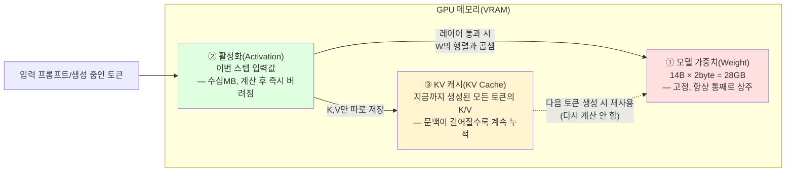

# LLM 파라미터가 개당 2byte면 14B는 2byte*14B만 메모리에 올리면 계산되나? 입력값은 얼마 안 먹어서 그런가?

## 결론부터

**절반은 맞고, 절반은 "지금 당장은" 맞는 이야기예요.** 매 순간 스쳐 지나가는 **입력/중간 계산값(활성화, activation)**이 가중치보다 훨씬 작다는 건 정확해요. 하지만 "입력값"이라고 뭉뚱그린 것 안에는 사실 **두 가지 다른 것**이 섞여 있어요 — 진짜로 미미한 **활성화 값**과, 생성이 길어질수록 계속 쌓이는 **KV 캐시**요. 짧은 대화에서는 KV 캐시도 작아서 "가중치만 올리면 끝"이라는 통념이 실무적으로 맞아떨어지지만, **문맥(컨텍스트)이 아주 길어지거나 여러 요청을 동시에 처리하면 이 KV 캐시가 가중치보다 더 커질 수도 있어요.**

## 다섯 살에게 설명하듯

거대한 요리책(모델 가중치, 14B × 2byte = 28GB)을 주방(VRAM/GPU 메모리)에 펼쳐놓고 요리하는 상황을 떠올려 보세요.

- **요리책(가중치, Weight)** = 미리 다 인쇄된 두꺼운 책이에요. 요리 하나를 만들 때마다 이 책의 **모든 페이지를 펼쳐봐야** 해서, 책 자체를 통째로 주방에 놓아둬야 해요. 이게 28GB짜리 덩치 큰 놈이고, 손님이 오든 안 오든 크기가 안 변해요.
- **지금 썰고 있는 재료(활성화, Activation)** = 손님 주문(입력 토큰) 하나 받아서 그 순간 도마 위에 올려둔 재료예요. 이건 한 접시 분량이라 아주 작아요 — 책 전체에 비하면 무시할 만해요. 사용자가 말한 "입력값은 얼마 안 먹는다"는 게 바로 이 부분이에요. 정확해요.
- **미리 썰어둔 재료 서랍(KV 캐시, KV Cache)** = 문제는 이거예요. 답변을 한 단어씩 이어 만들 때(자기회귀 생성), 매번 처음부터 대화 전체를 다시 요리책에서 찾아보면 너무 느려요. 그래서 **지금까지 나온 모든 단어에 대해 "이 재료는 이렇게 손질했었다"는 메모를 서랍에 계속 쌓아둬요.** 대화가 짧으면 서랍도 작지만, 대화가 아주 길어지면(수만~수십만 토큰) 이 서랍이 **요리책만큼, 혹은 그보다 더 커질 수도** 있어요.

## 기술적으로 풀어보면

### 1. GPU 메모리에 실제로 올라가는 3가지

추론(inference) 시 VRAM은 대략 이렇게 나뉘어요.

| 구성요소 | 크기 결정 요인 | 특징 |
|---|---|---|
| **모델 가중치(Weight)** | 파라미터 수 × 정밀도(byte) | **고정값** — 입력이 뭐든, 배치가 몇이든 안 변함 (14B × 2byte ≈ **28GB**) |
| **활성화(Activation)** | 이번 스텝에서 처리 중인 토큰 수 × hidden dim | 계산 도중 잠깐 쓰고 버려지는 값 — 진짜로 작음 (사용자가 말한 "입력값") |
| **KV 캐시(KV Cache)** | 레이어 수 × 헤드 수 × 헤드 차원 × **누적 토큰 수(문맥 길이)** × 정밀도 × 2(Key+Value) | 대화가 길어질수록/동시 요청이 많을수록 계속 커짐 |

핵심은 **"입력값 = 활성화"만 생각하면 맞는데, 실제로는 KV 캐시라는 별도의 "계속 쌓이는" 메모리가 하나 더 있다**는 거예요.

### 2. 왜 활성화는 정말 작은가

한 스텝에서 처리하는 텐서 크기는 대략 `배치 × 토큰 수 × hidden_dim × byte`예요. 예를 들어 hidden_dim이 5120인 모델에서 토큰 하나는 `5120 × 2byte ≈ 10KB`예요. 프롬프트가 2000 토큰이어도 `2000 × 10KB ≈ 20MB` 수준 — 28GB 가중치에 비하면 소수점 자릿수도 안 나올 정도로 미미해요. 이게 "입력값은 얼마 안 먹는다"가 맞는 이유예요.

### 3. 왜 KV 캐시는 "입력값"과 다른 취급을 받아야 하는가

트랜스포머는 단어를 하나씩 생성할 때마다, 그 전까지 나온 **모든** 토큰의 Key/Value 벡터를 매번 다시 계산하면 너무 느려서 **한 번 계산한 K/V는 캐시에 저장해두고 재사용**해요. 이 캐시는 토큰이 하나 생성될 때마다 **계속 늘어나요** — 입력값처럼 "이번 스텝만 잠깐 쓰고 버리는 값"이 아니라, **대화가 끝날 때까지 계속 들고 있어야 하는 값**이라는 게 결정적 차이예요.

대략적인 공식은 이래요:

```
KV 캐시(byte) ≈ 2(K,V) × 레이어 수 × KV헤드 수 × 헤드차원 × 정밀도(byte) × 문맥 길이(토큰 수)
```

같은 14B급 모델(레이어 48, KV헤드 8, 헤드차원 128, fp16)로 어림잡아 보면:

- 문맥 2,000 토큰: `2 × 48 × 8 × 128 × 2byte × 2,000 ≈ 0.4GB` → 28GB 가중치 옆에서는 여전히 무시할 만함
- 문맥 128,000 토큰(긴 문서/긴 대화): `2 × 48 × 8 × 128 × 2byte × 128,000 ≈ 25GB` → **가중치(28GB)와 맞먹는 크기가 됨**

즉 **"입력값(활성화)은 얼마 안 먹는다"는 명제 자체는 맞지만, 그 명제가 성립하는 건 문맥이 짧을 때뿐**이에요. 실무에서 서빙 엔진들이 "가중치 크기 × 1.25~1.4배 정도 여유를 더 잡으라"고 권장하는 이유가 바로 이 KV 캐시(+약간의 활성화) 예산이에요.

### 4. 그러면 애초에 "입력값"이 새로운 파라미터를 필요로 하지 않는 이유

입력 토큰을 숫자 벡터로 바꾸는 첫 단계(토큰 임베딩)조차 **새로운 파라미터를 만드는 게 아니라, 이미 로드해둔 가중치(임베딩 테이블)의 특정 행(row)을 찾아 읽는 것**뿐이에요. 그래서 "입력값을 처리하려면 입력값 크기만큼 가중치를 추가로 더 올려야 하나?"라는 걱정은 애초에 필요 없어요 — 임베딩 테이블도 이미 그 14B 파라미터 총합 안에 포함돼 있는 값이거든요.

## 요약 그림



가중치(①, 빨강)는 항상 크고 고정, 활성화(②, 초록)는 정말 작고 순간적, KV 캐시(③, 노랑)는 작게 시작하지만 대화가 길어질수록 자라나서 결국 가중치 크기를 위협할 수도 있는 존재예요.

## 요약

- "입력값은 메모리를 얼마 안 먹어서 가중치만 올리면 된다"는 말은 **활성화(activation)에 대해서는 맞는 말**이에요.
- 하지만 실제로는 활성화 말고 **KV 캐시**라는 게 하나 더 있고, 이건 대화(문맥)가 길어질수록 계속 쌓여서 짧은 대화에선 무시할 만하지만 긴 문맥/큰 배치에서는 가중치 크기에 맞먹거나 넘어설 수 있어요.
- 그래서 실무에서 VRAM을 잡을 땐 `가중치(2byte×파라미터 수)` + `KV 캐시 예산(문맥 길이·동시 요청 수에 비례)` + `활성화(무시 가능한 수준)`를 같이 고려해요.

Sources:
- [GPU Memory Sizing Guide for LLM Inference — RunPod](https://www.runpod.io/articles/guides/gpu-memory-sizing-guide-for-llm-inference)
- [Calculating GPU memory for serving LLMs — BentoML LLM Inference Handbook](https://bentoml.com/llm/getting-started/calculating-gpu-memory-for-llms)
- [What is GPU Memory and Why it Matters for LLM Inference — BentoML](https://www.bentoml.com/blog/what-is-gpu-memory-and-why-it-matters-for-llm-inference)
- [Qwen3-14B: Specifications and GPU VRAM Requirements — apxml.com](https://apxml.com/models/qwen3-14b)
- [VRAM Calculator 2026: 7B/13B/70B LLM GPU Requirements — PromptQuorum](https://www.promptquorum.com/local-llms/vram-calculator-local-llm)
- 이 저장소 내 관련 답변: [`model-parameters.md`](./model-parameters.md) (파라미터/하이퍼파라미터/생성 파라미터 구분)
