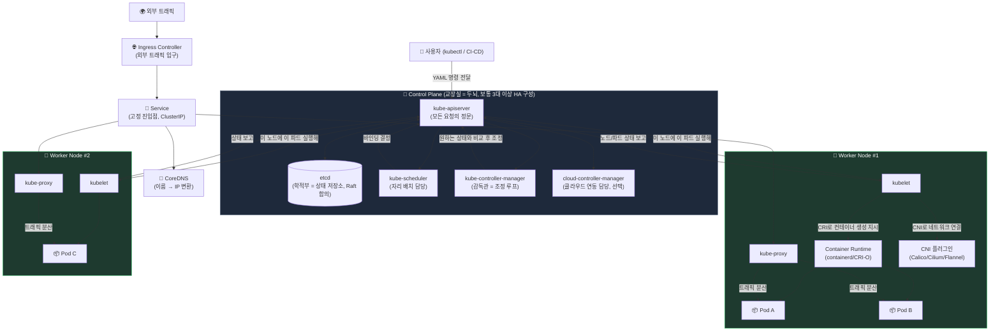
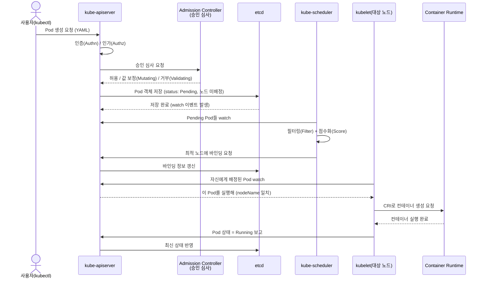
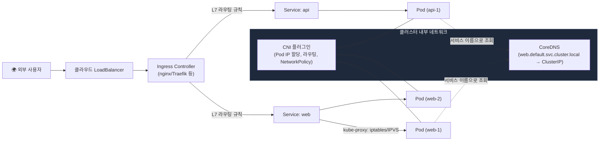

# Kubernetes 전체 아키텍처, 그림으로 보기

학교로 비유하면 **컨트롤 플레인(Control Plane)**은 "교장실"이고, **워커 노드(Worker Node)**는 "교실"이에요. 교장실에서 "이 학생(Pod) 3명을 반에 앉혀라"라고 지시하면, 교실 담임(kubelet)이 실제로 자리를 만들어 앉히고, 학교 안내 데스크(Service/DNS)는 학생이 바뀌어도 항상 같은 전화번호로 연결해줘요.

## 1. 클러스터 전체 한눈에 보기

## 2. Pod가 실제로 뜨기까지의 순서 (시퀀스)

"교장실에 요청서를 내면 → 검토(승인 심사) → 학적부에 기록 → 배치 담당이 교실 결정 → 담임이 실제로 학생을 앉힘" 순서예요.

## 3. 네트워킹 아키텍처 (트래픽이 흐르는 길)

## 4. 구성요소 정리 (전문용어 풀이)

| 구성요소 | 위치 | 역할 |
|---|---|---|
| **kube-apiserver** | Control Plane | 모든 요청이 반드시 거치는 정문. REST API로 클러스터 상태를 읽고 씀 |
| **etcd** | Control Plane | 클러스터의 모든 상태를 저장하는 분산 **키-값 저장소**. Raft 합의 알고리즘으로 일관성 보장 |
| **kube-scheduler** | Control Plane | 새 Pod를 "필터링(자원 부족 노드 제외) → 점수화(가장 적합한 노드 선정)" 과정으로 배치 |
| **kube-controller-manager** | Control Plane | Deployment, ReplicaSet 등 각종 컨트롤러를 돌리며 "원하는 상태 vs 현재 상태"를 계속 비교/조정하는 **조정 루프(Reconciliation Loop)** |
| **cloud-controller-manager** | Control Plane | AWS/GCP 등 클라우드 인프라(로드밸런서, 볼륨 등)와의 연동 담당 |
| **admission controller** | kube-apiserver 내부 | 인증/인가 이후, etcd 저장 이전에 요청을 가로채 값 보정(Mutating) 또는 거부(Validating) |
| **kubelet** | Worker Node | 각 노드에 상주하며 apiserver 지시를 받아 실제 컨테이너를 띄우고 상태를 보고하는 에이전트 |
| **kube-proxy** | Worker Node | Service로 들어온 트래픽을 알맞은 Pod로 분산시키는 네트워크 규칙(iptables/IPVS) 관리자 |
| **Container Runtime** | Worker Node | containerd, CRI-O 등 실제 컨테이너 실행 엔진. kubelet과는 **CRI(Container Runtime Interface)**로 통신 |
| **CNI 플러그인** | Worker Node | Calico, Cilium, Flannel 등. Pod에 IP를 할당하고 노드 간 라우팅, NetworkPolicy(방화벽 규칙)를 담당 |
| **CoreDNS** | 클러스터 전체 | `서비스이름.네임스페이스.svc.cluster.local` 같은 이름을 ClusterIP로 변환하는 클러스터 내부 DNS |
| **Ingress Controller** | 클러스터 전체 | 외부 HTTP(S) 트래픽을 도메인/경로 규칙에 따라 여러 Service로 분산시키는 L7 진입점 |

---

## 일반 설명

### 전체 구조: Control Plane과 Data Plane의 분리

Kubernetes 클러스터는 **Control Plane**과 **Node(Data Plane)**로 나뉜다. Control Plane은 클러스터의 "원하는 상태(desired state)"를 저장하고 판단만 할 뿐, 실제 컨테이너 실행은 Node 쪽 kubelet과 Container Runtime이 담당한다. 이 분리 덕분에 Control Plane은 실제 워크로드와 물리적으로 분리될 수 있고(관리형 Kubernetes 서비스, 예: EKS/GKE에서는 Control Plane을 클라우드 제공자가 완전히 관리), 프로덕션 환경에서는 보통 Control Plane을 3대 이상으로 구성해 고가용성(HA)을 확보한다.

### Control Plane 구성요소

- **kube-apiserver**: 클러스터의 유일한 진입점. 모든 컴포넌트(스케줄러, 컨트롤러, kubelet, kubectl)는 오직 API 서버를 통해서만 통신하며, 서버가 직접 etcd를 만지지 않는다. 요청은 인증(Authentication) → 인가(Authorization, 보통 RBAC) → **Admission Control**(Mutating/Validating Webhook 포함) 순서로 처리된 뒤에야 etcd에 기록된다.
- **etcd**: Raft 합의 알고리즘 기반의 분산 키-값 저장소로, 클러스터의 유일한 진실의 원천(Source of Truth)이다. API 서버는 리소스 변경 시 etcd의 **watch** 메커니즘을 이용해 다른 컴포넌트에 이벤트를 스트리밍한다. 이 watch 기반 통신이 스케줄러와 kubelet이 폴링 없이 즉시 반응할 수 있는 핵심 이유다.
- **kube-scheduler**: 아직 노드가 배정되지 않은(`nodeName`이 비어 있는) Pending Pod를 watch하다가, **필터링(Filtering, 예: 자원 부족·taint 불일치 노드 제외)**과 **스코어링(Scoring, 예: 자원 여유·어피니티 규칙 기반 점수화)** 두 단계를 거쳐 최적 노드에 바인딩한다.
- **kube-controller-manager**: Deployment, ReplicaSet, Node, Job 등 각종 컨트롤러의 집합체로, 각 컨트롤러는 독립적인 **조정 루프(Reconciliation Loop)**를 통해 "선언된 스펙 vs 실제 상태"의 차이를 지속적으로 좁힌다.
- **cloud-controller-manager**: 클라우드 제공자별 로직(LoadBalancer 프로비저닝, Node 라이프사이클, Route 관리 등)을 core 컨트롤러에서 분리해낸 컴포넌트로, on-prem 환경에서는 존재하지 않을 수 있다.

### Node(Worker) 구성요소

- **kubelet**: 각 노드의 에이전트로, API 서버가 자신에게 할당한 PodSpec을 watch하며 그 상태를 실제로 구현한다. 컨테이너 실행 자체는 **CRI(Container Runtime Interface)** 표준을 통해 containerd나 CRI-O 같은 런타임에 위임한다.
- **kube-proxy**: 각 노드에서 Service의 ClusterIP를 실제 Pod IP로 매핑하는 네트워크 규칙(iptables 또는 성능이 더 좋은 IPVS 모드)을 관리한다. Cilium 같은 eBPF 기반 CNI를 쓰는 경우 kube-proxy 없이 eBPF만으로 이 역할을 대체하기도 한다(kube-proxy replacement).
- **CNI(Container Network Interface) 플러그인**: Calico, Cilium, Flannel, Weave 등. Pod에 클러스터 내부 IP를 할당하고 노드 간 라우팅을 구성하며, NetworkPolicy(파드 단위 방화벽 규칙)를 실제로 강제(enforce)하는 역할도 겸한다. Calico는 iptables 규칙으로, Cilium은 eBPF 프로그램으로 이를 구현해 더 낮은 오버헤드를 제공한다.

### 요청이 Pod가 되기까지의 흐름

1. 사용자가 `kubectl apply`로 Pod(혹은 Deployment) 스펙을 제출하면 API 서버가 인증/인가 후 Admission Controller 체인을 통과시킨다.
2. 통과한 객체는 `status: Pending`, 노드 미배정 상태로 etcd에 저장된다.
3. kube-scheduler가 이 Pending 상태를 watch로 감지해 필터링·스코어링을 거쳐 특정 노드에 바인딩한다(바인딩 자체도 API 서버를 통해 etcd에 반영).
4. 해당 노드의 kubelet이 자신에게 배정된 Pod를 watch로 감지하고, CRI를 통해 실제 컨테이너를 생성한 뒤 CNI로 네트워크를 연결한다.
5. kubelet은 컨테이너 상태를 지속적으로 API 서버에 보고하고, 이는 다시 etcd에 반영되어 `kubectl get pods`에서 확인 가능해진다.

이 전 과정이 폴링이 아닌 **watch(long-polling 기반 이벤트 스트림)** 로 이루어진다는 점이 Kubernetes 아키텍처의 핵심 설계 원칙 중 하나다 — 모든 컴포넌트가 "명령을 받는" 것이 아니라 "원하는 상태를 관찰하고 스스로 맞춘다"는 **레벨-트리거드(level-triggered) 조정 모델**을 따른다.

### 네트워킹: Service, DNS, Ingress

- **Service**는 여러 Pod를 하나의 고정된 ClusterIP/DNS 이름으로 추상화한다. Pod는 재시작마다 IP가 바뀌지만 Service는 안정적인 진입점을 유지한다.
- **CoreDNS**는 `<service>.<namespace>.svc.cluster.local` 형태의 이름을 Service의 ClusterIP로 변환해주는 클러스터 내부 DNS 서버로, 대부분의 배포판에서 기본 애드온으로 설치된다.
- **Ingress Controller**(nginx-ingress, Traefik 등)는 클러스터 외부에서 들어오는 HTTP(S) 트래픽을 도메인/경로 규칙에 따라 여러 Service로 라우팅하는 L7 계층의 단일 진입점 역할을 한다. 트래픽이 많아지고 서비스 간 통신에 대한 세밀한 제어(재시도, mTLS, 서킷브레이커)가 필요해지면 Istio, Linkerd 같은 **서비스 메시(Service Mesh)** 를 사이드카 형태로 추가하기도 한다.

Sources:
- [Cluster Architecture | Kubernetes](https://kubernetes.io/docs/concepts/architecture/)
- [Communication between Nodes and the Control Plane | Kubernetes](https://kubernetes.io/docs/concepts/architecture/control-plane-node-communication/)
- [Admission Control in Kubernetes | Kubernetes](https://kubernetes.io/docs/reference/access-authn-authz/admission-controllers/)
- [Kubernetes architecture: control plane, data plane, and 11 core components explained | Flexera](https://www.flexera.com/blog/finops/kubernetes-architecture-11-core-components-explained/)
- [How does the Kubernetes scheduler work? | learnkube](https://learnkube.com/kubernetes-scheduler-explained)
- [How the Kubernetes control plane works | learnkube](https://learnkube.com/kubernetes-control-plane)
- [Understanding Kubernetes Networking | Cilium Blog](https://cilium.io/blog/2026/04/25/understanding-kubernetes-networking/)
- [Kubernetes Networking Explained: From ClusterIP to Cilium Service Mesh | freeCodeCamp](https://www.freecodecamp.org/news/kubernetes-networking-explained-from-clusterip-to-cilium-service-mesh/)
- [System Design: Kubernetes Networking Deep Dive | techinterview](https://www.techinterview.org/post/3233474203/system-design-kubernetes-networking-deep-dive-cni-calico-cilium-service-mesh-network-policy-ingress-dns-ebpf/)
