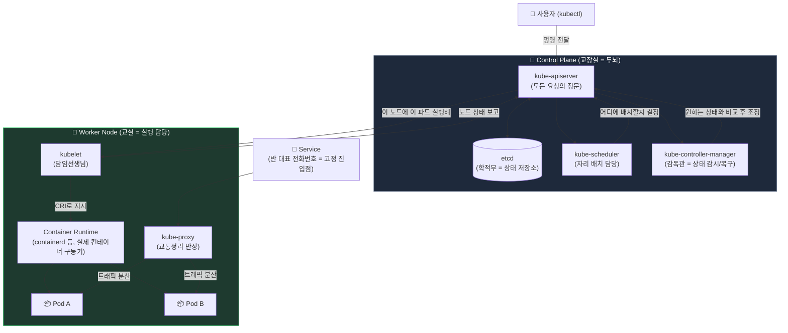

# Kubernetes 아키텍처, 그림으로 보기

학교로 비유하면 **컨트롤 플레인(Control Plane)**은 "교장실"이고, **워커 노드(Worker Node)**는 "교실"이에요. 교장실에서 지시를 내리면, 교실에서 그대로 실행해요.

## 그림 읽는 법 (전문용어 정리)

- **kube-apiserver**: 모든 요청이 반드시 거치는 정문. "관리 API 서버"라고 봐요.
- **etcd**: 클러스터의 모든 상태(설정, 현재 상황)를 저장하는 **키-값 저장소(Key-Value Store)**. 학적부처럼 진실의 원천(Source of Truth)이에요.
- **kube-scheduler**: 새 Pod를 "어느 노드에 놓을지" 결정하는 배치 담당자.
- **kube-controller-manager**: "원하는 상태 vs 지금 상태"를 계속 비교하며 차이를 메우는 **조정 루프(Reconciliation Loop)** 담당자.
- **kubelet**: 각 노드에 상주하며 API 서버의 지시를 받아 실제로 컨테이너를 띄우고 상태를 보고하는 에이전트.
- **kube-proxy**: Service로 들어온 트래픽을 알맞은 Pod로 분산시키는 네트워크 규칙(iptables/IPVS) 관리자.
- **Container Runtime**: containerd, CRI-O처럼 실제로 컨테이너를 실행하는 저수준 엔진. kubelet이 **CRI(Container Runtime Interface)**로 이야기를 건네요.

**출처**
- [Kubernetes Architecture Explained | Devopscube](https://devopscube.com/kubernetes-architecture-explained/)
- [A sysadmin's guide to basic Kubernetes components | Red Hat](https://www.redhat.com/en/blog/kubernetes-components)
- [Kubernetes Architecture Diagram: Components & Best Practices | groundcover](https://www.groundcover.com/learn/kubernetes/kubernetes-architecture-diagram)
