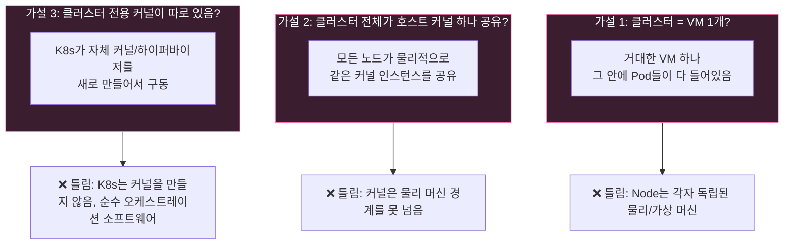
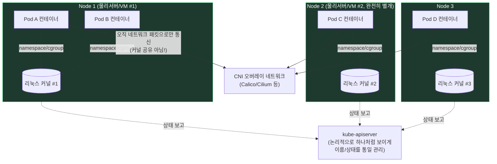

# 쿠버네티스 클러스터는 커널을 어떻게 쓰는가? (VM 1개? 클러스터 커널? 호스트 공유?)

셋 다 아니에요. 정답은 **"섬(Node)마다 자기 커널이 따로 있고, 그 섬들을 다리(네트워크)로 이어서 하나처럼 보이게 만든 것"**이에요. 섬 안에서는 도커처럼 커널을 같이 쓰지만, 섬과 섬 사이에는 커널 공유가 전혀 없어요 — 그냥 배(네트워크 패킷)로 오갈 뿐이에요.

## 세 가지 가설 vs 실제 구조

## 실제 구조: "노드별 독립 커널 + 네트워크로 이어붙인 착시"

## 요약 표

| 범위 | 커널 공유 여부 | 근거 |
|---|---|---|
| **같은 Node 안, 같은 Pod 안 컨테이너들** | ✅ 공유 (네트워크 namespace까지 공유해서 `localhost` 통신 가능) | 도커와 동일한 원리, [[pod-host-kernel-sharing]] 참고 |
| **같은 Node 안, 다른 Pod들** | ✅ 공유 (namespace/cgroup으로 격리만 함) | 커널 인스턴스 자체는 하나 |
| **다른 Node에 있는 Pod들** | ❌ 공유 안 함 (완전히 별개의 커널) | Node = 별도의 물리/가상 머신, 오직 네트워크로만 연결 |
| **클러스터 전체** | ❌ "클러스터 커널" 같은 건 존재하지 않음 | K8s는 소프트웨어 오케스트레이터일 뿐, 커널이나 하이퍼바이저가 아님 |

---

## 일반 설명

### 커널 공유의 경계는 정확히 "Node"에서 끊긴다

Linux 커널은 하드웨어(또는 그 하드웨어를 흉내 낸 가상 머신) 한 대 위에서 부팅되는 단일 인스턴스다. 커널이 물리적/가상적 머신 경계를 넘어 여러 대에 걸쳐 존재할 수 있는 방법은 없다. 따라서:

- **Node 내부**: 같은 Node에서 도는 모든 Pod/컨테이너는 그 Node가 부팅한 **단 하나의 커널 인스턴스**를 공유한다. 컨테이너 런타임(containerd, CRI-O)이 그 커널의 **Namespace**(PID, Mount, Network, UTS, IPC 등)와 **cgroup**을 이용해 프로세스를 논리적으로만 격리한다. 이건 도커 컨테이너의 격리 방식과 완전히 동일하다.
- **Node 사이**: Node A와 Node B는 물리적으로 다른 커널이 각자 독립적으로 돌아간다. 서로의 프로세스 목록도, 파일시스템도, 메모리도 전혀 볼 수 없고, 오직 **네트워크 인터페이스를 통한 패킷 교환**으로만 상호작용한다.

### 그럼 클러스터가 "하나처럼" 보이는 이유는?

커널을 공유해서가 아니라, **소프트웨어 계층에서 통일된 뷰를 제공**하기 때문이다.

1. **kube-apiserver + etcd**: 모든 Node/Pod의 상태를 중앙(논리적으로) 저장소에 모아두므로 `kubectl get pods -A`로 클러스터 전체를 한 화면에서 볼 수 있다. 이건 상태 조회 API의 통일이지, 커널의 통일이 아니다.
2. **CNI(오버레이/언더레이 네트워크)**: 서로 다른 Node에 있는 Pod라도 마치 같은 평평한 네트워크(flat network) 위에 있는 것처럼 Pod IP로 직접 통신 가능하게 해준다. Calico/Cilium 같은 CNI 플러그인이 BGP 라우팅이나 VXLAN 터널링으로 이 "가상의 단일 네트워크" 착시를 만든다.
3. **CoreDNS**: 어느 Node에 떠 있든 상관없이 서비스 이름 하나로 접근 가능하게 해서, 물리적 위치를 완전히 숨긴다.

즉 Kubernetes가 만드는 "하나의 시스템처럼 보이는 착시"는 **네트워크 계층 + 컨트롤 플레인의 상태 통합**으로 만들어지는 것이지, 실제 커널이나 하이퍼바이저를 클러스터 단위로 새로 만든 게 절대 아니다. Kubernetes 자체는 커널 코드를 한 줄도 갖고 있지 않은 순수 사용자 공간(userspace) 오케스트레이션 소프트웨어다.

### 예외: 정말로 "가짜 커널"을 하나 더 두는 경우

강한 격리가 필요한 멀티테넌시 환경에서는 Kata Containers나 gVisor처럼 **Pod 하나마다 경량 마이크로 VM(별도 커널)을 진짜로 새로 띄우는** 런타임을 쓰기도 한다. 이 경우는 "Node 안에서도 Pod마다 커널을 분리"하는 특수 사례이며, 기본 containerd/runc 조합의 표준 동작은 아니다. 이 부분은 [[pod-host-kernel-sharing]]에서 다룬 User Namespace(v1.36 GA) 한계와도 이어진다.

Sources:
- [Pods | Kubernetes](https://kubernetes.io/docs/concepts/workloads/pods/)
- [cgroups and Namespaces — The Linux Kernel's Building Blocks Behind Containers | DEV Community](https://dev.to/kobbyprincee/cgroups-and-namespaces-the-fundamental-building-blocks-of-linux-containers-and-orchestration-53e3)
- [Why Kubernetes Namespace Isolation Fails | vCluster](https://www.vcluster.com/blog/kubernetes-namespace-isolation-failures)
- [Kubernetes User Namespaces Don't Fix the Shared Kernel | Edera](https://edera.dev/stories/kubernetes-finally-has-user-namespace-support-the-shared-kernel-problem-remains)
