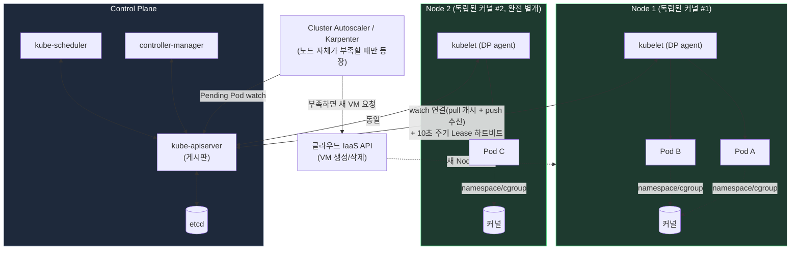
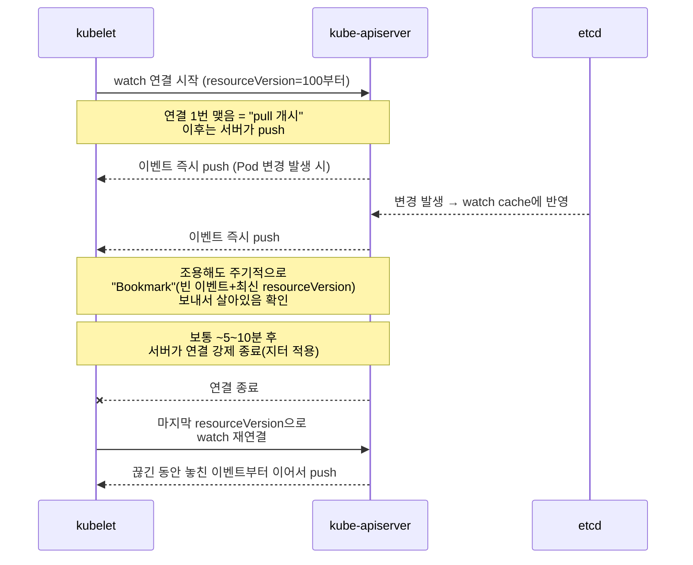
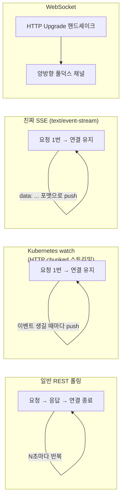

# 지금까지 정리: 커널 공유 / Node 구조 / 오토스케일링 / Watch의 신선도

지금까지 나온 이야기를 한 장으로 요약하면 이래요.

> **섬(Node)마다 자기 커널이 따로 있고**, 그 섬들은 다리(네트워크)로만 연결돼요. 본사(Control Plane)는 게시판(API 서버)에 "이 섬은 이런 상태여야 한다"는 목표만 붙여두고, 각 지점(kubelet)이 그 게시판을 **전화선을 미리 연결해두고 계속 실시간으로 받아보는 방식**으로 확인해요. 전화를 몇 분마다 다시 거는 게 아니라, 한 번 연결해두면 새 소식이 생길 때마다 바로바로 전달되는 거예요. 다만 그 전화선도 오래 붙잡아두면 끊어야 해서 주기적으로 다시 걸긴 하고, "지점이 살아있냐"를 확인하는 훨씬 짧은 주기의 안부 전화(하트비트)는 별도로 있어요.

## 1. 전체 그림 (커널 공유 + CP/DP + 오토스케일링)

## 2. Watch 연결의 실제 생명주기 (핵심 질문에 대한 답)

## 3. "얼마나 신선한 정보인가"는 항목마다 다르다

| 항목 | 방식 | 실제 주기/지연 |
|---|---|---|
| Pod 스펙 변경 감지 (kubelet, scheduler 등) | **watch (push 기반 스트리밍)** | 폴링 주기 없음. etcd 변경 → apiserver watch cache → 스트림 전파까지 보통 **밀리초~1초 내외** |
| watch 연결 자체의 재연결 | 서버가 강제 종료 후 클라이언트가 재연결 | 기본 **약 5~10분**(지터 적용, thundering herd 방지) |
| Node가 "살아있다"는 하트비트 | Lease 객체 갱신 | **10초마다** (Lease duration 40초의 1/3 주기) |
| Node가 응답 없을 때 NotReady 판정 | controller-manager의 grace period | 하트비트 40초 이상 끊기면 **NotReady 전환** |
| Pod를 죽은 Node에서 축출(evict) | pod-eviction-timeout | NotReady 후 기본 **약 5분** 대기 후 축출 |
| kubelet의 전체 재동기화(안전망) | 로컬 풀 재확인 (watch 이벤트 누락 대비) | 기본 **1분마다** 전체 상태 재검증 |

---

## 일반 설명

### 1) 커널 공유 경계 = Node ([[pod-host-kernel-sharing]], [[kubernetes-cluster-kernel-model]])

같은 Node 안의 Pod들은 그 Node가 부팅한 단 하나의 Linux 커널을 공유하며 namespace/cgroup으로만 논리적으로 격리된다. 반면 서로 다른 Node는 물리적으로 완전히 분리된 커널을 갖고, 오직 네트워크 패킷으로만 상호작용한다. Kubernetes 자체는 커널이나 하이퍼바이저를 만들지 않는 순수 유저스페이스 오케스트레이션 소프트웨어다.

### 2) Node = 이미 존재하는 머신 + kubelet(DP agent)

Kubernetes가 VM을 만드는 게 아니라, 이미 프로비저닝된 머신(VM이든 베어메탈이든)에 kubelet을 설치해 클러스터에 join시키는 구조다. join 이후 이 머신은 **Data Plane**의 일원이 되어, Control Plane이 etcd에 기록해둔 "이 Node에 배정된 PodSpec"을 스스로 watch하며 로컬 조정 루프를 돈다.

### 3) 오토스케일링은 3개 레이어 ([[kubernetes-worker-node-autoscaling]])

- HPA(복제본 수), VPA(개별 Pod 크기)는 **이미 존재하는 Node의 여유 자원 안**에서 해결되므로 K8s 코어 컨트롤러만으로 충분하다.
- 반면 **Node 자체를 늘리는 것**은 클라우드 IaaS API 호출이 필요한, K8s 코어 권한 밖의 일이라 Cluster Autoscaler/Karpenter라는 별도 컴포넌트가 필요하다.

### 4) Watch는 "주기적 폴링"이 아니라 "한 번 연결한 뒤 서버가 밀어주는(push) 스트림"이다

REST API를 매번 다시 요청하는 전통적 폴링과 달리, Kubernetes의 watch는 클라이언트가 `?watch=true&resourceVersion=X`로 **HTTP 커넥션을 한 번 열어두면**, 그 이후 etcd에서 발생하는 변경 이벤트가 apiserver의 watch cache를 거쳐 **연결이 살아있는 동안 실시간으로 push**된다. 따라서 "주기"라는 개념 자체가 이 경로에는 없고, 신선도는 폴링 주기가 아니라 **etcd 변경 → watch cache 반영 → 네트워크 전파에 걸리는 지연(보통 서브초~1초)**으로 결정된다.

다만 사용자가 지적한 "결국 pull이 있어야 이벤트를 받을 수 있다"는 통찰은 정확하다 — 다음과 같은 **진짜 주기적 요소**들이 시스템 곳곳에 실제로 존재한다.

- **Watch 커넥션 자체의 수명**: apiserver는 하나의 watch 연결을 무한정 유지하지 않고 보통 5~10분(지터 적용) 후 강제로 끊는다. 클라이언트는 마지막으로 받은 `resourceVersion`을 기준으로 즉시 재연결하며, 그 사이 놓친 이벤트가 있으면 이어서 받거나(아직 watch cache 보관 범위 내) 너무 오래돼서 범위를 벗어났으면 `410 Gone`을 받고 전체 리스트(list)부터 다시 받아야 한다. 조용한 연결에도 apiserver가 주기적으로 빈 "Bookmark" 이벤트(최신 resourceVersion만 담은)를 보내 "나 아직 살아있고 최신까지 왔다"는 걸 알려준다.
- **kubelet의 로컬 전체 재동기화**: watch 이벤트 유실 가능성에 대비해 kubelet은 `--sync-frequency`(기본 **1분**) 주기로 자신이 담당하는 전체 Pod 상태를 처음부터 다시 검증하는 안전망을 돌린다. 이건 순수 watch 실패를 보완하는 보험 성격이다.
- **Node 하트비트(Lease)**: kubelet이 "나 살아있다"는 걸 알리는 것은 watch가 아니라 별도의 **Lease 객체 갱신**이다. 기본적으로 Lease duration이 40초, 그 1/3인 **10초마다** 갱신 요청을 보낸다. controller-manager는 이 Lease 갱신이 끊기면(기본 grace period 40초) 해당 Node를 `NotReady`로 판정하고, 이후 `pod-eviction-timeout`(기본 약 5분)이 지나면 그 Node의 Pod들을 다른 Node로 축출(evict)한다.

즉 정보의 "신선도"는 하나의 고정된 폴링 주기로 결정되는 게 아니라, **① 실시간 스트리밍(watch, 서브초 단위)** 과 **② 안전망 성격의 주기적 재검증(재동기화 1분, 하트비트 10초, watch 재연결 5~10분)** 이 계층적으로 겹쳐서 만들어지는 결과다. 평상시 반응 속도는 ①이 지배하고, 장애(연결 끊김, 이벤트 유실) 상황에서의 "최악의 경우 지연"은 ②의 각 주기 값들이 상한선을 정한다.

### 5) 그럼 SSE인가? 왜 WebSocket을 안 쓰나?

**개념적으로는 SSE(Server-Sent Events)와 같은 부류**(HTTP 하나로 서버 → 클라이언트 단방향 스트리밍)이지만, 엄밀히는 SSE 스펙(`Content-Type: text/event-stream`, `data:` 줄 포맷, 브라우저 `EventSource` API 자동 재연결)을 그대로 쓰는 게 아니다. Kubernetes watch는 **`Transfer-Encoding: chunked`를 활용한 자체 포맷의 HTTP 스트리밍**이다 — 응답 바디를 끝내지 않고 JSON(또는 protobuf) 객체를 줄 단위로 계속 흘려보낸다. "SSE류의 기법을 커스텀 포맷으로 재구현한 것"이라고 보면 정확하다.

**단, "WebSocket이 원래 더 무겁다"는 건 정확한 이유가 아니다.** 바이트/핸드셰이크 수준만 보면 둘의 비용은 비슷하다 — WebSocket 핸드셰이크도 HTTP 요청 1번 + 101 응답 1번일 뿐이고(chunked GET 요청 1번과 대동소이), WS 프레임 헤더(2~14바이트)와 chunked encoding의 청크 크기 헤더도 비슷한 수준의 오버헤드다. 진짜 차이는 다른 곳에 있다.

- **연결 멀티플렉싱**: 고전적 WebSocket(RFC 6455)은 HTTP/1.1 `Upgrade`로 TCP 연결 하나를 통째로 WS 전용으로 전환해버려서, 그 연결은 다른 요청과 공유되지 않는다. 반면 watch는 HTTP/2 스트림으로 동작해 kubelet·컨트롤러·`kubectl get -w` 수천 개가 **TCP 연결 몇 개에 스트림 다중화**될 수 있다. apiserver의 동시 watcher가 수천~수만 개 규모임을 감안하면, 이 차이가 실제 소켓/파일 디스크립터 자원으로 누적된다.
- WebSocket을 HTTP/2 위에서 쓰는 방법(RFC 8441, Extended CONNECT)도 있지만 이는 나중에 추가된 확장이라, 경로상의 모든 프록시/로드밸런서가 지원한다는 보장이 없어 인프라 호환성 문제가 다시 등장한다.
- **엔지니어링 비용**: WS는 별도의 연결 상태 머신(ping/pong 유지, close handshake, 클라이언트→서버 프레임 마스킹)이 필요한데, 이건 런타임 비용이라기보다 안 쓰는 기능(양방향)을 위한 코드 복잡도·유지보수 비용에 가깝다.

즉 "WebSocket이 근본적으로 무겁다"가 아니라, **watch 용도에는 그 부가 기능(양방향, 별도 상태 머신)이 불필요한 데다, HTTP/2 멀티플렉싱·기존 REST 인프라와의 궁합이 chunked 스트리밍 쪽이 더 좋다**는 것이 정확한 이유다.

다만 흥미롭게도 **`kubectl exec`/`attach`/`port-forward`처럼 stdin/stdout/stderr를 동시에 주고받아야 하는 진짜 양방향 스트리밍 기능**에서는 얘기가 다르다. 이 경우는 원래 SPDY 기반 프레이밍 프로토콜을 썼는데, SPDY가 사실상 폐기(deprecated)되면서 **Kubernetes 1.31부터 기본값이 WebSocket으로 전환**됐다 — 즉 "양방향이 진짜 필요한 곳"에는 WebSocket을, "서버 → 클라이언트 단방향이면 충분한" watch에는 그 상태 관리 비용을 지지 않고 HTTP 스트리밍을 쓰는 것이다.

### 6) HTTP/2 멀티플렉싱이 실제로 어떻게 일어나는지는 별도 문서로

apiserver가 watch를 포함한 여러 요청을 TCP 연결 1개 위에서 어떻게 동시에 처리하는지(Stream ID, 프레임 인터리빙, 이벤트 기반 디먹서 구조)는 Kubernetes에 국한된 내용이 아니라 HTTP/2 자체의 일반 동작 원리라서 [[http2-multiplexing-and-http1-coexistence|별도 문서]]로 분리했다. 거기서 브라우저가 아직도 HTTP/1.1을 지원하는 이유까지 함께 다룬다.

Sources:
- [Leases | Kubernetes](https://kubernetes.io/docs/concepts/architecture/leases/)
- [How to Use the Kubernetes Watch API with HTTP Streaming](https://oneuptime.com/blog/post/2026-02-09-kubernetes-watch-api-http-streaming/view)
- [How to Implement Efficient Resource Watching with Bookmarks and ResourceVersion](https://oneuptime.com/blog/post/2026-02-09-resource-watching-bookmarks-resourceversion/view)
- [Diving into Kubernetes' Watch Cache | Pierre Zemb's Blog](https://pierrezemb.fr/posts/diving-into-kubernetes-watch-cache/)
- [Move frequent Kubelet heartbeats to Lease API | kubernetes/enhancements #589](https://github.com/kubernetes/enhancements/issues/589)
- [kubelet: change node-lease-renew-interval to 0.25 of lease-renew-duration | kubernetes/kubernetes #80429](https://github.com/kubernetes/kubernetes/pull/80429)
- [Understanding Kubernetes Watch Mechanism, HTTP Long Polling, and Chunked Transfer Encoding](https://yongli.dev/posts/understanding_kubernetes_watch_mechanism_http_long_polling_and_chunked_transfer_encoding/)
- [Kubernetes 1.31: WebSockets transition for kubectl exec/attach/port-forward](https://kubernetes.io/blog/2024/08/20/websockets-transition)
- [RFC 8441: Bootstrapping WebSockets with HTTP/2](https://www.rfc-editor.org/rfc/rfc8441.html)
- [WebSocket Protocol: RFC 6455 Handshake, Frames & More | WebSocket.org](https://websocket.org/guides/websocket-protocol/)
