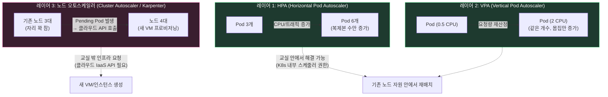
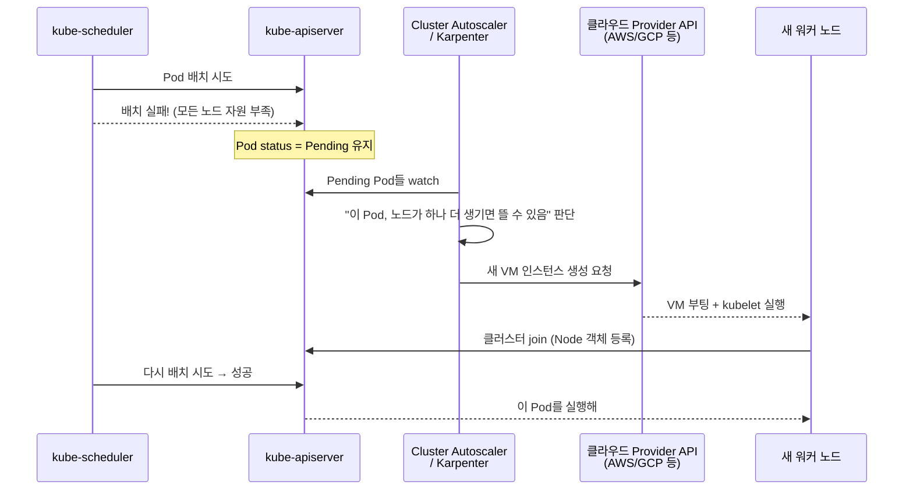

# 워커 노드는 왜 스스로 오토스케일링이 안 될까?

교실에 학생이 늘어나면 "책상을 더 놓거나(HPA), 책상을 더 크게 바꾸는 것(VPA)"은 담임선생님이 교실 안에서 바로 할 수 있어요. 그런데 **교실 자체가 부족해지면** 얘기가 달라져요 — 새 교실을 만들려면 학교 예산 담당자가 건설회사(클라우드 제공자)에 전화해서 벽을 새로 세워야 해요. Kubernetes의 두뇌(Control Plane)는 "교실 안" 일은 잘하지만, "건물을 새로 짓는 일"은 원래 자기 권한 밖이라 **Cluster Autoscaler**나 **Karpenter** 같은 별도 담당자를 불러야 해요.

## 오토스케일링의 3개 레이어

## 노드가 부족할 때 실제로 벌어지는 일

## Cluster Autoscaler vs Karpenter

| | Cluster Autoscaler | Karpenter |
|---|---|---|
| 동작 단위 | 미리 정의된 **노드 그룹(ASG/MIG)** 크기 조절 | 노드 그룹 없이 클라우드 API로 **즉석 프로비저닝** |
| 인스턴스 선택 | 노드 그룹에 고정된 타입만 사용 | Pending Pod 요구사항에 맞춰 최적 인스턴스 타입 직접 선택 |
| 속도 | 노드 하나 뜨는 데 보통 3~4분 | 45~90초 수준으로 빠름 |
| 축소(Consolidation) | 저활용 노드 제거 위주 | 저활용 노드를 적극적으로 재배치·통합해 활용률 최적화 |

Sources:
- [Kubernetes Cluster Autoscaler vs Karpenter: When to Use Each (2026) | DEV Community](https://dev.to/alexandrev/kubernetes-cluster-autoscaler-vs-karpenter-when-to-use-each-2026-1dgc)
- [Karpenter vs. Cluster Autoscaler | Spacelift](https://spacelift.io/blog/karpenter-vs-cluster-autoscaler)
- [Kubernetes Autoscaling 2026: HPA, VPA and Cluster Autoscaler](https://www.alekseialeinikov.com/en/blog/topics/devops/kubernetes-autoscaling-2026-hpa-vpa-cluster-autoscaler)
- [Kubernetes Autoscaling in 2026: HPA, VPA, KEDA, and When to Use Each](https://devstarsj.github.io/2026/06/26/kubernetes-autoscaling-hpa-vpa-keda-2026/)

---

## 일반 설명

### 왜 K8s 코어는 "노드 자체"를 오토스케일링하지 않는가

Kubernetes의 오토스케일링은 실제로 세 개의 독립적인 레이어로 나뉜다.

1. **HPA(Horizontal Pod Autoscaler)**: 특정 워크로드의 **Pod 복제본 수**를 CPU/메모리 사용률이나 커스텀 메트릭(요청 QPS 등)에 따라 늘리거나 줄인다.
2. **VPA(Vertical Pod Autoscaler)**: Pod 개수는 그대로 두고 개별 Pod의 **CPU/메모리 요청(request) 값**을 실제 사용 패턴에 맞춰 재조정한다.
3. **노드 오토스케일러(Cluster Autoscaler / Karpenter)**: 이 둘과 근본적으로 다르다. 위 두 레이어는 **이미 클러스터에 조인된 노드들의 여유 자원 안에서** 스케줄러가 재배치하는 문제라서, kube-scheduler와 kube-controller-manager가 API 서버 안에서 전부 해결할 수 있다. 반면 "노드 자체를 늘린다"는 것은 **실제 VM/베어메탈 인스턴스를 새로 부팅**해야 하는 일이고, 이는 클라우드 제공자(AWS EC2, GCP Compute Engine 등)의 IaaS API를 호출하는 영역이다. Kubernetes의 Node 객체는 어디까지나 "이미 존재하고 kubelet이 등록을 마친" 머신을 표현하는 리소스일 뿐, K8s 코어 API에는 애초에 "새 VM을 만들어라"라는 개념 자체가 없다.

이 경계는 `cloud-controller-manager`가 클라우드 인프라(LoadBalancer, Route, Node 라이프사이클)와 연동하는 것과 비슷한 이유다 — 클라우드마다 인스턴스 타입, 리전, 프로비저닝 API가 전부 다르기 때문에, 이 부분을 K8s 코어에 하드코딩하지 않고 **애드온(추가 컨트롤러)**으로 분리해둔 것이다. 그래서 노드 오토스케일링은 항상 Cluster Autoscaler나 Karpenter 같은 별도 컴포넌트가 필요하다.

### Cluster Autoscaler의 동작 방식과 한계

Cluster Autoscaler는 스케줄링에 실패해 `Pending` 상태로 남은 Pod를 watch하다가, 미리 정의된 **노드 그룹(AWS의 Auto Scaling Group, GCP의 Managed Instance Group 등)**의 크기를 늘리는 방식으로 동작한다. 노드 그룹 단위로만 움직이기 때문에 인스턴스 타입 선택의 유연성이 낮고, 클라우드 VM 부팅 시간까지 포함해 보통 노드 하나가 뜨는 데 3~4분이 걸린다.

### Karpenter가 등장한 이유

Karpenter는 노드 그룹이라는 중간 추상화를 아예 걷어내고, Pending Pod의 요구사항(CPU/메모리/GPU 등)을 직접 분석해 클라우드 API로 **가장 적합한 인스턴스 타입을 즉석에서** 프로비저닝한다. 이 덕분에 노드 기동 속도가 45~90초 수준으로 빨라지고, 저활용 노드를 적극적으로 통합(consolidation)해 Cluster Autoscaler 대비 40~60% 더 높은 노드 활용률을 낸다는 보고가 있다.

### 실무에서 자주 발생하는 실패 패턴

HPA가 새 Pod를 순식간에 만들어내는데 노드 오토스케일러의 노드 프로비저닝 속도가 이를 못 따라가면, Pending Pod가 쌓이는 **"thundering herd" 현상**이 발생한다. 이는 레이어 2(Pod 크기/개수)의 문제를 레이어 3(노드 용량) 도구 없이는 근본적으로 해결할 수 없다는 것을 보여주는 대표적 사례이며, 세 레이어를 각각 다른 도구로 다뤄야 하는 이유이기도 하다.
