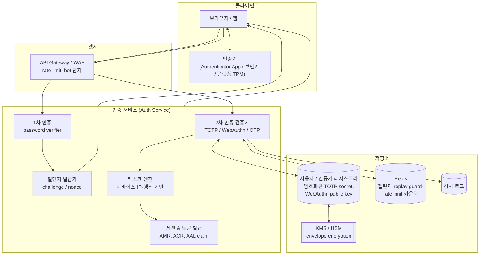
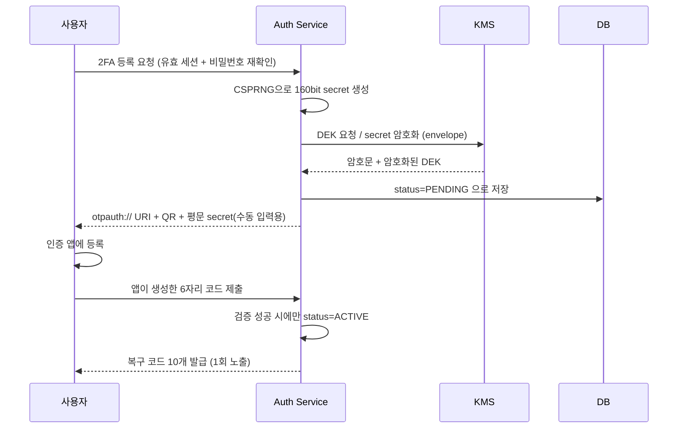
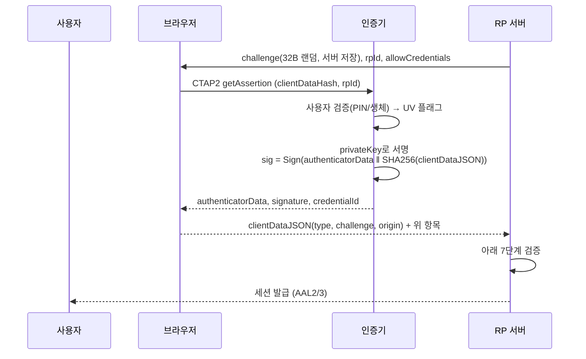

# 2FA 검증 아키텍처

## 쉬운 설명

집에 들어갈 때 **열쇠(비밀번호)** 하나만 쓰면, 누가 열쇠를 훔치면 끝이에요. 그래서 문을 하나 더 만들어요. 두 번째 문은 "지금 이 순간에만 맞는 숫자"를 물어봐요.

그 숫자는 어떻게 맞출까요? 나랑 문이 **똑같은 비밀 주문서**를 하나씩 나눠 가지고 있어요. 시계를 보고 같은 주문서로 계산하면 둘 다 같은 숫자가 나와요. 30초 지나면 숫자가 바뀌니까 훔쳐가도 금방 쓸모없어져요. (= TOTP)

더 좋은 방법도 있어요. 문이 "이 수수께끼에 도장 찍어봐"라고 하면, 내 폰 안에 있는 **나만의 도장**으로 찍어서 보내요. 도장 자체는 절대 밖으로 안 나가고, 문은 도장 모양만 보고 "맞네!" 하고 열어줘요. 가짜 문한테는 도장이 안 찍혀요 — 내 도장은 "진짜 문 주소"에서만 찍히게 만들어졌거든요. (= 패스키/WebAuthn)

---

## 일반 설명

### 1. 인증 요소(Authentication Factor)와 2FA의 정의

| 요소 | 영문 | 예시 |
|---|---|---|
| 지식 | something you **know** | 비밀번호, PIN |
| 소유 | something you **have** | 스마트폰(TOTP 앱), 보안키(YubiKey), 패스키가 저장된 디바이스 |
| 생체/특성 | something you **are** | 지문, 얼굴 |

2FA(Two-Factor Authentication)는 **서로 다른 범주**의 요소 2개를 요구하는 것이다. "비밀번호 + 보안 질문"은 둘 다 지식 요소라 2FA가 아니다. MFA(Multi-Factor Authentication)는 2개 이상을 포괄하는 상위 개념이다.

NIST SP 800-63B-4(Rev.4, 2025 최종본)는 이를 **AAL(Authenticator Assurance Level)** 로 등급화한다.

| 등급 | 요구사항 | 대표 수단 |
|---|---|---|
| AAL1 | 단일 요소 허용 | 비밀번호만 |
| AAL2 | 다중 요소 인증기 1개 또는 서로 다른 단일 요소 2개. **피싱 저항 옵션을 최소 하나 제공해야 함** | 비밀번호 + TOTP, 패스키 |
| AAL3 | 하드웨어 기반 인증기 + **피싱 저항 필수**, 검증자 위조 저항 | FIDO2 보안키, PIV/스마트카드 |

Rev.4의 실무적 파급은 **SMS OTP의 지위 하락**이다. SIM 스와핑·SS7 가로채기·AiTM 중계 때문에 SMS/음성 기반 OTP는 "restricted authenticator"로 분류되며, 민감 데이터를 다루는 AAL2 시스템은 TOTP 앱 이상 또는 FIDO2/WebAuthn으로 이전해야 한다.

---

### 2. 전체 아키텍처 구성

2FA는 단일 컴포넌트가 아니라 **등록(enrollment) → 검증(verification) → 세션 승격(session assurance) → 복구(recovery)** 4개의 라이프사이클을 가지는 서브시스템이다.



핵심 설계 원칙 3가지:

1. **1차 인증과 2차 인증 사이의 상태는 서버가 소유한다.** 비밀번호 검증 후 곧바로 세션 토큰을 주면 안 된다. `mfa_pending` 상태의 **단기 중간 토큰**(수명 2~5분, 단일 목적, 2차 검증 외에는 어떤 API도 호출 불가)을 발급한다. 클라이언트가 "나 1차 통과했어"라고 주장하게 두면 그 자체가 우회 경로가 된다.
2. **검증기는 인증 수단별로 플러그인화한다.** `Authenticator` 인터페이스(`enroll`, `verify`, `revoke`)를 두고 TOTP/WebAuthn/백업코드가 각각 구현체가 되면, NIST 권고 변경(SMS 폐기 등)에 저장소 스키마만 남기고 교체할 수 있다.
3. **검증 결과는 세션에 등급으로 기록된다.** 단순 boolean이 아니라 "어떤 수단으로, 언제 인증했는가"(AMR/ACR/auth_time)를 남겨야 스텝업 인증이 가능해진다.

---

### 3. TOTP 검증 아키텍처 (RFC 4226 / RFC 6238)

#### 3.1 알고리즘

TOTP는 HOTP의 카운터를 시간으로 대체한 것이다.

```
HOTP(K, C) = DynamicTruncate( HMAC-SHA1(K, C) ) mod 10^d      ... RFC 4226
TOTP(K, T) = HOTP(K, floor((unixtime - T0) / X))              ... RFC 6238
             T0 = 0, X = 30초, d = 6자리 (관례적 기본값)
```

**Dynamic Truncation(DT)** 은 20바이트 HMAC 출력에서 4바이트를 뽑아내는 과정이다.

```
offset = hash[19] & 0x0F                       // 마지막 니블을 오프셋으로
binary = (hash[offset]   & 0x7F) << 24
       | (hash[offset+1] & 0xFF) << 16
       | (hash[offset+2] & 0xFF) << 8
       | (hash[offset+3] & 0xFF)
code   = binary % 1_000_000
```

`& 0x7F`로 최상위 비트를 죽이는 이유는 **부호 있는 정수 해석 차이로 언어 간 결과가 갈리는 것을 막기 위해서**다(자바의 signed int 문제). 오프셋을 해시값에서 유도하는 것은 고정 위치 추출 대비 분석 저항을 높이기 위함이다.

시크릿은 Base32로 인코딩되어 `otpauth://` URI에 담기고, QR 코드로 전달된다.

```
otpauth://totp/Example:alice@example.com
  ?secret=JBSWY3DPEHPK3PXP
  &issuer=Example
  &algorithm=SHA1&digits=6&period=30
```

> 호환성 주의: Google Authenticator 계열 다수는 `algorithm`/`digits` 파라미터를 무시하고 SHA1/6자리로 고정 동작한다. SHA256으로 올리고 싶다면 사전 검증이 필요하다. 암호학적으로 HMAC-SHA1은 여기서 여전히 안전하다(SHA-1 충돌 공격은 HMAC 위조로 이어지지 않는다).

#### 3.2 등록(Enrollment) 흐름



**"검증 전 활성화 금지"** 가 핵심이다. QR을 잘못 스캔했거나 앱 등록에 실패한 상태로 ACTIVE가 되면 사용자는 영구 잠금된다. 등록 확인 코드를 통과해야만 활성화한다.

#### 3.3 검증 로직

```python
def verify_totp(user_id: str, submitted: str, now: int) -> bool:
    # 0) 레이트 리밋 — 실패 카운터 선증가 (실패 시 감소 금지)
    if not rate_limiter.allow(f"totp:{user_id}", limit=5, window=300):
        raise TooManyAttempts()

    rec = db.get_totp(user_id)
    if rec.status != "ACTIVE":
        return False

    secret = kms.decrypt(rec.enc_secret, rec.enc_dek)   # 메모리 체류 최소화

    step = now // 30
    # 1) 시계 드리프트 허용: ±1 스텝 (= 최대 ±30초, 실질 유효창 90초)
    for w in (-1, 0, 1):
        candidate = totp(secret, step + w)
        if hmac.compare_digest(candidate, submitted):    # 2) 상수 시간 비교
            # 3) 재사용(replay) 차단
            if rec.last_used_step is not None and (step + w) <= rec.last_used_step:
                audit.log("TOTP_REPLAY", user_id)
                return False
            db.update_last_used_step(user_id, step + w)
            rate_limiter.reset(f"totp:{user_id}")
            return True

    audit.log("TOTP_FAIL", user_id)
    return False
```

각 방어 장치의 근거:

| 항목 | 이유 |
|---|---|
| **드리프트 윈도우 ±1** | RFC 6238이 명시적으로 허용. ±2 이상은 유효 코드 수를 늘려 무차별 대입 성공률을 선형 증가시킨다. |
| **상수 시간 비교** | `==` 비교는 앞자리부터 불일치 시 조기 종료되어 타이밍 사이드채널이 생긴다. 6자리 숫자라도 원격 타이밍 공격 대상이다. |
| **last_used_step 기록** | TOTP 코드는 30초간 유효하므로, 어깨너머로 보거나 AiTM으로 가로챈 코드를 같은 창 안에서 재사용할 수 있다. **사용한 스텝 이하를 전면 거부**해야 한다. |
| **레이트 리밋** | 6자리 = 100만 경우의 수. 드리프트 3창 고려 시 시도당 성공확률 ≈ 3/10⁶. 무제한 시도면 몇 시간 만에 뚫린다. 5회/5분 + 계정 단위·IP 단위 이중 카운터를 둔다. |
| **암호화 저장** | TOTP 시크릿은 **대칭 공유 비밀**이다. 평문 DB 유출 = 전 사용자 2차 인증 무력화. 비밀번호처럼 해시할 수 없으므로(서버가 원문으로 재계산해야 함) **KMS 기반 봉투 암호화(envelope encryption)** 가 유일한 해법이다. |

#### 3.4 봉투 암호화 구조

```
평문 secret ──AES-256-GCM(DEK)──> 암호문 ──┐
                                            ├──> DB (암호문 + 암호화된 DEK + AAD로 user_id)
DEK ──KMS의 CMK로 암호화──> 암호화된 DEK ───┘
```

DEK를 KMS에 매번 요청하지 않고 CMK로 감싼 DEK를 데이터와 함께 저장하는 방식이다. KMS 호출량과 비용을 줄이면서 CMK 로테이션만으로 전체 키 교체가 가능하다. AAD(Additional Authenticated Data)에 `user_id`를 넣으면 **레코드 교체 공격**(A의 암호문을 B의 행에 붙여넣기)을 차단할 수 있다.

---

### 4. WebAuthn / 패스키 검증 아키텍처

TOTP의 구조적 한계는 **사용자가 코드를 눈으로 읽고 손으로 옮긴다**는 점이다. 가짜 사이트가 그 코드를 받아 진짜 사이트에 즉시 중계하면(AiTM) 그대로 통과한다. WebAuthn은 이 경로를 프로토콜 레벨에서 제거한다.

#### 4.1 구성 요소

- **Relying Party (RP)**: 우리 서비스. RP ID는 등록 가능한 도메인(`example.com`).
- **Client**: 브라우저/OS. `navigator.credentials.create()` / `.get()` 호출, origin 검증 수행.
- **Authenticator**: 개인키 보관 주체. 플랫폼(TPM/Secure Enclave) 또는 로밍(USB/NFC 보안키). CTAP2로 통신.
- **FIDO2** = WebAuthn(W3C, 브라우저↔서버) + CTAP2(FIDO, 브라우저↔인증기).

#### 4.2 인증(Assertion) 검증 흐름



서버 검증 체크리스트:

1. `clientDataJSON.type === "webauthn.get"` — 등록용 서명을 인증에 재사용하는 공격 차단
2. `clientDataJSON.challenge` == 서버가 발급·저장한 챌린지 (일회성, 사용 즉시 폐기, TTL 수 분) — **리플레이 차단**
3. `clientDataJSON.origin` == 기대 origin (`https://example.com`) — **피싱 차단의 본체**. 가짜 도메인에서는 브라우저가 다른 origin을 넣으므로 서명이 무효화된다. 사용자가 속아도 프로토콜이 막는다.
4. `authenticatorData.rpIdHash` == SHA-256(rpId)
5. 플래그: `UP`(0x01, 사용자 존재) 필수, 2FA/AAL2 이상이면 `UV`(0x04, 사용자 검증) 필수. `BE`(0x08 backup eligible)/`BS`(0x10 backed up)로 동기화 패스키 여부를 판별해 정책 분기
6. 서명 검증: 저장해둔 **공개키**로 `authenticatorData ‖ SHA256(clientDataJSON)` 검증
7. `signCount` — 저장값보다 커야 함. 감소하면 **인증기 복제** 의심 신호. 단, 동기화 패스키(iCloud/Google 계정)는 대개 0을 반환하므로 0이면 검사를 건너뛴다.

#### 4.3 저장 모델의 차이

| | TOTP | WebAuthn |
|---|---|---|
| 서버 저장 항목 | **공유 비밀**(암호화 필수) | **공개키**(유출돼도 위조 불가) |
| DB 유출 영향 | 전 사용자 2차 인증 무력화 | 실질 영향 없음 |
| 피싱 저항 | 없음 (코드 중계 가능) | 있음 (origin 바인딩) |
| 오프라인 가능 | 예 | 인증기 접근 필요 |
| NIST 등급 | AAL2 | AAL2 / AAL3(하드웨어 키) |

#### 4.4 "2FA로서의 패스키"라는 모호함

패스키는 디바이스 소유(have) + 생체/PIN(are/know)을 **한 번의 제스처로 동시 검증**하므로 그 자체가 다중 요소다. 따라서 아키텍처 선택지가 갈린다.

- **1st-factor 대체**: 비밀번호 없이 패스키만 (passwordless). NIST상 AAL2 충족.
- **2nd-factor로 사용**: 비밀번호 + 보안키. 레거시 정책 호환이 쉽지만 UX는 열등.

현실적 권고는 **패스키를 1차로 두고 비밀번호를 폐기하되, 계정당 인증기를 2개 이상 등록하도록 강제**하는 것이다(디바이스 분실 대비).

---

### 5. 세션 승격과 스텝업 인증

2FA의 결과물은 "로그인 성공"이 아니라 **세션에 붙는 신뢰 등급**이다. OIDC 표준 클레임을 그대로 쓰는 것이 이식성이 좋다.

```json
{
  "sub": "user-123",
  "auth_time": 1789000000,
  "amr": ["pwd", "otp"],          // 사용된 인증 방식 목록
  "acr": "aal2",                  // 달성 등급
  "sid": "sess-abc"
}
```

**스텝업(step-up) 인증**은 리소스별로 요구 등급과 신선도(freshness)를 선언하고, 미달 시 재인증을 요구하는 구조다.

```python
POLICY = {
    "GET  /profile":        {"acr": "aal1"},
    "POST /payment-method": {"acr": "aal2", "max_age": 300},   # 5분 이내 2FA
    "POST /api-keys":       {"acr": "aal2", "max_age": 300, "require_phishing_resistant": True},
    "POST /mfa/disable":    {"acr": "aal2", "max_age": 60},
}

def enforce(req, claims):
    p = POLICY[req.route]
    if rank(claims["acr"]) < rank(p["acr"]):
        raise StepUpRequired(p["acr"])
    if "max_age" in p and now() - claims["auth_time"] > p["max_age"]:
        raise ReauthRequired()
```

특히 **"2FA 해제" 자체가 가장 강한 인증을 요구해야 하는 엔드포인트**다. 세션을 훔친 공격자가 2FA를 꺼버리면 전체 설계가 무의미해진다.

---

### 6. 복구(Recovery) — 가장 약한 고리

통계적으로 MFA 우회의 상당수는 암호 해독이 아니라 **복구 흐름 악용**이다. 복구 경로는 반드시 2차 인증과 **동등한 강도**로 설계한다.

**백업/복구 코드**
- 10개 내외, 각 128bit 이상 엔트로피(예: Base32 10자 이상)
- **해시 저장**(Argon2id 또는 bcrypt). TOTP 시크릿과 달리 서버가 원문을 재계산할 필요가 없으므로 해시가 가능하다.
- 1회용 — 사용 즉시 소각, 남은 개수 알림
- 재발급은 기존 2FA 검증 후에만
- 코드 제출도 레이트 리밋 대상

**안티패턴**
- "이메일로 복구 링크" 단독 — 이메일 계정이 탈취되면 2FA가 무력화된다. 이메일은 **보조 신호**로만 쓰고 단독 우회 경로로 만들지 않는다.
- 상담원 수동 초기화에 검증 절차 없음 — 소셜 엔지니어링의 주 표적(2023년 MGM/Caesars 사건 유형)
- SMS를 최후 복구 수단으로 남겨두기 — SIM 스와핑으로 전체 체인이 SMS 수준으로 하향 평준화된다

---

### 7. 위협 모델과 대응 매핑

| 공격 | 메커니즘 | 대응 |
|---|---|---|
| **OTP 무차별 대입** | 6자리 반복 시도 | 계정+IP 이중 레이트 리밋, 지수 백오프, 실패 임계 시 알림 |
| **TOTP 리플레이** | 같은 30초 창 내 코드 재사용 | `last_used_step` 기록 후 이하 거부 |
| **SIM 스와핑 / SS7** | 통신사 계정 탈취로 SMS 가로채기 | SMS OTP 폐기(NIST Rev.4 restricted), TOTP/FIDO2 이전 |
| **MFA Fatigue (푸시 폭탄)** | 승인 푸시를 새벽에 수십 회 발송해 오승인 유도 | 숫자 매칭, 로그인 컨텍스트(위치·앱·IP) 표시, 미응답 시 요청 차단, 연속 거부 시 계정 잠금 |
| **AiTM 프록시 피싱** (Evilginx, Tycoon2FA 등) | 리버스 프록시로 IdP 세션 전체 중계 → 인증 후 **세션 쿠키 탈취** | WebAuthn origin 바인딩으로 인증 단계 차단 + **토큰 바인딩/mTLS/DPoP**, 세션 수명 단축, 디바이스 핑거프린트 이상 시 재인증 |
| **인증기 복제** | 시크릿 추출 후 복제 | WebAuthn `signCount` 역행 탐지, 하드웨어 인증기(추출 불가 키) |
| **복구 흐름 악용** | 헬프데스크 소셜 엔지니어링 | 복구도 AAL2 요구, 상담원 초기화에 별도 검증 + 대기 기간 + 알림 |
| **세션 고정/승격 누락** | 1차 인증 후 세션 ID 유지 | 2FA 성공 시 **세션 ID 재발급(rotation)**, 중간 토큰 즉시 폐기 |

> 숫자 매칭에 대한 중요한 단서: 최신 AiTM 킷은 프록시된 IdP 페이지에서 표시된 숫자를 긁어 피해자에게 그대로 보여준다. CISA도 숫자 매칭을 "완화책이지 피싱 저항 통제는 아니다"로 분류한다. **구조적으로 AiTM을 제거하는 것은 FIDO2/WebAuthn뿐**이다.

---

### 8. 자체 구현 vs 위임

| 축 | 자체 구현 | IdP 위임 (Auth0/Okta/Entra ID/Keycloak/Cognito) |
|---|---|---|
| 통제력 | 높음 | 정책 범위 내 |
| 초기 비용 | 낮음 | 라이선스/MAU 과금 |
| 운영 부담 | 시크릿 로테이션, KMS, 감사, 표준 추적 전부 자체 부담 | 위임 |
| WebAuthn 복잡도 | attestation 파싱, CBOR/COSE 처리 등 난이도 높음 | 내장 |
| 적합 | 보안 요구가 특수하거나 인증이 제품 핵심인 경우 | 대부분의 일반 서비스 |

자체 구현 시에도 **암호 프리미티브는 절대 직접 작성하지 않는다.** 검증된 라이브러리를 쓴다 — TOTP: `otplib`(Node), `pyotp`(Python), `java-otp`, `totp-rs`(Rust) / WebAuthn: `SimpleWebAuthn`(Node), `py_webauthn`(Python), `webauthn4j`(Java), `webauthn-rs`(Rust).

---

### 9. 구현 체크리스트

**등록**
- [ ] 2FA 등록 시작 전 비밀번호 재확인(또는 최근 인증 검사)
- [ ] 시크릿은 CSPRNG 160bit 이상
- [ ] 코드 검증 성공 전까지 PENDING 유지
- [ ] 복구 코드 1회 노출 후 해시 저장
- [ ] 인증기 2개 이상 등록 유도

**저장**
- [ ] TOTP 시크릿: KMS 봉투 암호화, AAD에 user_id
- [ ] 복구 코드: Argon2id 해시
- [ ] WebAuthn: 공개키·credentialId·signCount·aaguid·transports 저장
- [ ] 로그·에러·APM에 시크릿/코드 절대 미기록

**검증**
- [ ] 드리프트 ±1 스텝
- [ ] 상수 시간 비교
- [ ] `last_used_step` 리플레이 가드
- [ ] 계정·IP 이중 레이트 리밋 + 지수 백오프
- [ ] WebAuthn 챌린지 서버 저장·일회성·짧은 TTL
- [ ] origin / rpIdHash / UV 플래그 / signCount 전부 검증
- [ ] 실패 메시지에 "코드 오류"와 "2FA 미등록"을 구분 노출하지 않음(계정 열거 방지)

**세션**
- [ ] 1차 통과 후 단일 목적 단기 중간 토큰만 발급
- [ ] 2FA 성공 시 세션 ID 재발급
- [ ] AMR/ACR/auth_time 기록
- [ ] 민감 작업에 스텝업 + max_age 정책
- [ ] 2FA 설정 변경 시 다른 세션 전부 무효화 + 알림 발송

**운영**
- [ ] 2FA 등록/해제/실패/복구코드 사용 전부 감사 로깅
- [ ] 이상 패턴(연속 실패, 심야 푸시 폭주) 알림
- [ ] 세션 토큰 수명 단축 + 리프레시 시 리스크 재평가

---

## Sources

- [NIST SP 800-63B-4: Digital Identity Guidelines — Authentication and Authenticator Management](https://pages.nist.gov/800-63-4/sp800-63b.html)
- [NIST CSRC: SP 800-63B-4 Final](https://csrc.nist.gov/pubs/sp/800/63/b/4/final)
- [RFC 6238: TOTP: Time-Based One-Time Password Algorithm](https://www.rfc-editor.org/info/rfc6238/)
- [The guts of 2FA: RFC-4226 and RFC-6238 — GeekLaunch](https://geeklaunch.io/blog/the-guts-of-two-factor-authentication/)
- [Implementing TOTP From Scratch — RFC 6238 Test Vectors and Web Crypto](https://dev.to/sendotltd/implementing-totp-from-scratch-rfc-6238-test-vectors-and-web-crypto-10fl)
- [Quick overview of WebAuthn, FIDO2 and CTAP — Yubico](https://developers.yubico.com/Passkeys/Quick_overview_of_WebAuthn_FIDO2_and_CTAP.html)
- [WebAuthn vs FIDO2: Key Differences and Use Cases — Descope](https://www.descope.com/blog/post/webauthn-vs-fido2)
- [Understanding FIDO2, WebAuthn, and Passkeys — Alf Løkken](https://alflokken.github.io/posts/understanding-fido2-passkeys/)
- [How to Stop MFA Push-Fatigue Attacks with Number Matching and Login Context — OneUptime](https://oneuptime.com/blog/post/2026-08-29-how-to-stop-mfa-push-fatigue-attacks-with-number-matching-and-login-context/view)
- [Beyond MFA: Defending Against AiTM Phishing in 2026 — Maverc](https://maverc.com/blog/modern-mfa-bypass-aitm)
- [How Attackers Bypass MFA: Fatigue, AiTM & Hijacking — Adaptive Security](https://www.adaptivesecurity.com/blog/mfa-bypass-attacks)
