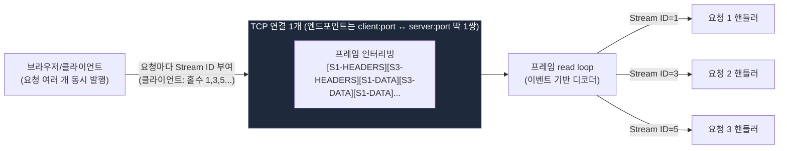
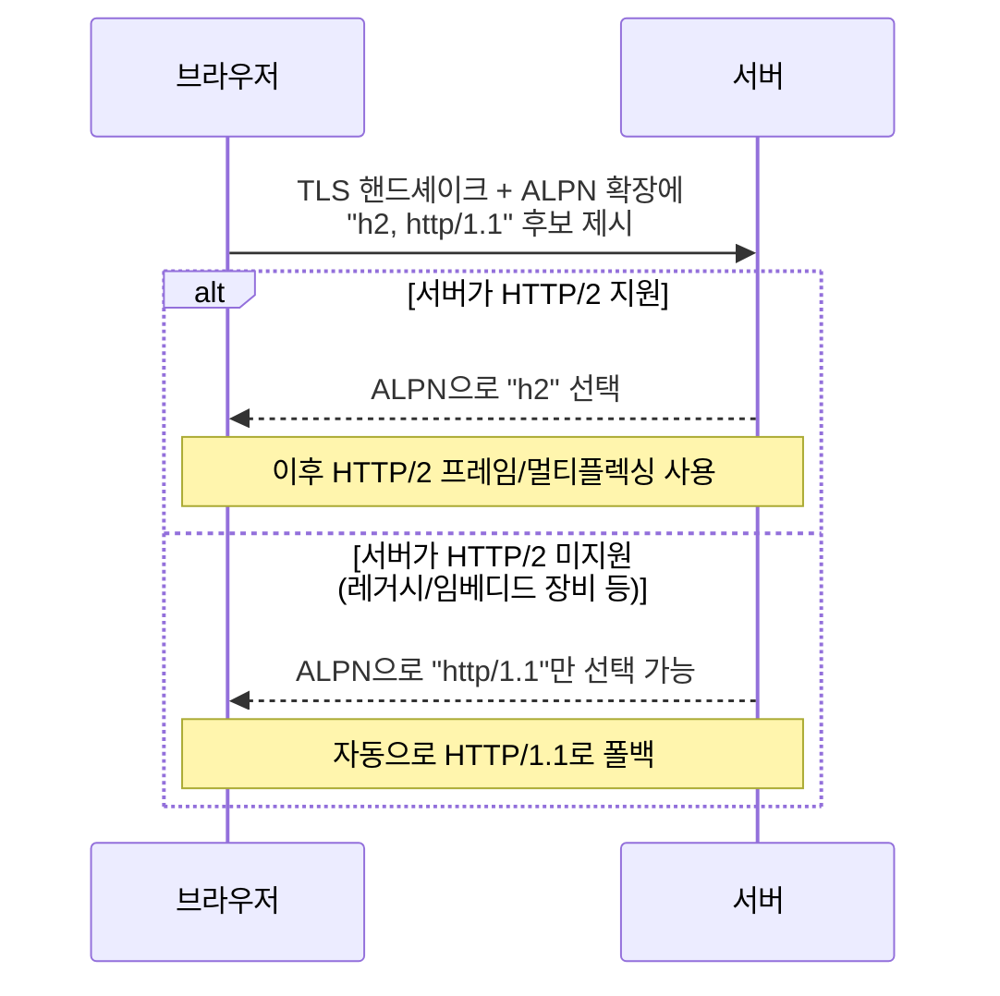

# HTTP/2 멀티플렉싱은 어떻게 동작하고, 브라우저는 왜 아직도 HTTP/1.1을 지원할까?

전화선 하나(TCP 연결 하나)로 여러 사람이 동시에 통화하는 걸 상상해보세요. HTTP/1.1은 "한 사람 통화 끝나야 다음 사람이 통화 시작"이었는데, HTTP/2는 각자 말할 때마다 "나 1번이야", "나 3번이야"라고 짧게 번호표를 붙여서 말을 잘게 끊어 보내요. 받는 쪽은 번호표만 보고 누구 말인지 다시 조립하면 돼요 — 전화선(연결)은 하나인데 여러 대화(요청)가 동시에 진행되는 것처럼 보이는 거죠.

## 1. HTTP/2 멀티플렉싱 구조

- **엔드포인트는 정말 하나**다. client IP:port ↔ server IP:port로 맺어진 TCP 연결 1개만 있으면, 그 위에서 여러 요청이 동시에 오갈 수 있다.
- HTTP/2는 요청/응답을 통째로 주고받지 않고, 훨씬 작은 **프레임**(HEADERS, DATA, WINDOW_UPDATE, SETTINGS 등) 단위로 쪼갠다. 프레임마다 9바이트 고정 헤더 안에 **Stream ID**(논리 채널 번호, 클라이언트 시작 스트림은 홀수 1·3·5, 서버 시작은 짝수 2·4·6)가 박혀 있다.
- TCP는 여전히 순서가 있는 바이트 스트림 1개이므로 프레임들이 물리적으로 동시에 전송되진 않지만, 작은 단위로 잘게 **인터리빙**되어 순서대로 나간다(스트림1 프레임 → 스트림3 프레임 → 스트림1 프레임 → ...). 프레임이 작기 때문에 HTTP/1.1의 "응답 하나 끝나야 다음 시작" head-of-line blocking이 HTTP 계층에서 사라진다.
- 받는 쪽은 소켓에서 바이트를 읽는 **이벤트 기반 read loop**가 앞단에서 프레임 헤더의 Stream ID만 보고 알맞은 논리 채널(핸들러)로 역다중화(demultiplex)한다. Go로 작성된 서버(예: Kubernetes의 kube-apiserver)는 연결당 프레임 read/write goroutine 1개가 이 이벤트 루프 역할을 하고, 새 HEADERS 프레임(새 스트림 시작)이 오면 해당 요청 처리용 goroutine을 띄운다 — nginx/Node.js의 이벤트 루프 + 워커 모델과 본질적으로 같은 패턴이다.

## 2. 그럼 브라우저는 왜 아직도 HTTP/1.1을 쓰나?

**"이 멀티플렉싱 엔진을 브라우저가 구현하기 부담스러워서"가 아니다.** Chrome, Firefox, Safari, Edge 전부 HTTP/2 스택을 이미 다 구현해뒀다 — 즉 브라우저 쪽은 이 엔진을 만드는 비용을 이미 지불했다. HTTP/1.1이 남아있는 진짜 이유는 정반대 방향, **서버 쪽의 이질성과 프로토콜 협상(negotiation)** 때문이다.

핵심 메커니즘은 **ALPN(Application-Layer Protocol Negotiation)**이다. TLS 핸드셰이크 과정에서 브라우저가 "나는 h2도 되고 http/1.1도 돼"라고 후보를 제시하면, 서버가 자기가 지원하는 것 중 하나를 골라 응답한다. 서버가 HTTP/2를 지원 안 하면 자동으로 http/1.1로 협상되어 폴백된다 — 이건 TLS 버전 협상과 똑같은 "점진적 프로토콜 진화" 방식이지, 브라우저 구현 부담과는 무관하다.

그럼 왜 여전히 HTTP/2를 지원 안 하는 서버가 있을까? 여기서 인과관계가 뒤집힌다 — **HTTP/2 엔진(HPACK 헤더 압축 상태 관리, 스트림별 흐름 제어 윈도우, 프레임 파서/디먹서)을 제대로 구현하는 게 HTTP/1.1(줄 단위 텍스트 파싱)보다 훨씬 공학적으로 복잡하다.** 그래서 임베디드 장비, 사내 내부 시스템, 오래된 CMS/미들박스, 단순한 개발용 서버 등 상당수는 애초에 HTTP/2를 구현하지 않고 HTTP/1.1만 말한다. 브라우저는 이런 서버와도 통신해야 하므로 HTTP/1.1 클라이언트 능력을 계속 유지하는 것이다. 즉:

- **브라우저**: 이미 두 프로토콜 다 구현했고, ALPN으로 자동 선택할 뿐 추가 부담이 크지 않다.
- **서버 생태계**: 여전히 HTTP/1.1만 구현한 곳이 많다 (엔진 구현 난이도가 실제 이유).
- 그래서 브라우저는 호환성을 위해 HTTP/1.1을 "버리지 못하고" 계속 들고 간다.

추가로, 브라우저는 **평문(HTTP, 비-TLS) 연결에서는 사실상 HTTP/2를 쓰지 않는다.** ALPN은 TLS 확장이라 TLS 위에서만 동작하고, 평문에서 HTTP/2로 업그레이드하는 `h2c`(cleartext HTTP/2) 방식은 RFC 9113에서 사실상 폐기(obsolete)됐고 어떤 주요 브라우저도 지원하지 않는다. 그래서 `http://` 로 접속하면 브라우저는 자동으로 HTTP/1.1을 쓴다 — 이것도 "브라우저가 이 상황에서 HTTP/1.1을 필요로 하는" 또 하나의 실제 이유다.

## 요약 표

| 질문 | 답 |
|---|---|
| HTTP/2 멀티플렉싱은 연결을 여러 개 쓰나? | 아니다. TCP 연결 1개, Stream ID로 프레임을 논리적으로만 구분 |
| 역다중화는 누가 하나? | 소켓을 읽는 이벤트 기반 read loop(디먹서)가 프레임 헤더의 Stream ID 기준으로 라우팅 |
| 브라우저가 HTTP/1.1 쓰는 이유는 엔진 구현 부담 때문? | 아니다. 브라우저는 이미 둘 다 구현함. 서버 쪽이 HTTP/2를 구현 안 한 경우가 많아서 ALPN 협상으로 자동 폴백하는 것 |
| 평문(http://) 연결은? | ALPN이 TLS 전용이라 협상 자체가 불가능 → 브라우저는 평문에선 사실상 HTTP/1.1만 사용 (h2c는 폐기 수순) |

---

## 일반 설명

### HTTP/2 프레임 계층과 스트림

HTTP/1.1까지는 "하나의 TCP 연결 = 한 번에 하나의 요청/응답"이 원칙이었고(파이프라이닝이 있었지만 순서 보장 문제로 사실상 사장됨), 브라우저들은 이를 우회하려고 도메인당 6개 안팎의 TCP 연결을 병렬로 열어 동시성을 흉내 냈다. HTTP/2는 이 문제를 프로토콜 레벨에서 해결한다.

- **Stream**: 하나의 HTTP 요청/응답 교환에 대응하는 논리적 채널. 실제 소켓이나 포트가 아니라 프레임 헤더에 박힌 31비트 **Stream Identifier** 필드로만 구분된다.
- **Frame**: HEADERS, DATA, SETTINGS, WINDOW_UPDATE, RST_STREAM, GOAWAY 등 타입이 있는 최소 전송 단위. 모든 프레임은 9바이트 공통 헤더(길이, 타입, 플래그, Stream ID)를 갖는다.
- **인터리빙(Interleaving)**: 여러 스트림의 프레임이 하나의 TCP 바이트 스트림 위에서 순서대로 섞여 전송된다. 이 덕분에 큰 응답 하나가 다른 응답들을 막지 않는다(HTTP 레이어에서의 head-of-line blocking 해소. 단, TCP 자체의 패킷 손실로 인한 HOL blocking은 여전히 남아있어 이는 QUIC 기반의 HTTP/3에서 해결된다).
- **역다중화(Demultiplexing)**: 수신 측은 소켓에서 바이트를 읽는 루프가 프레임을 순서대로 파싱하며 Stream ID를 확인하고, 각 스트림에 대응하는 버퍼/핸들러로 데이터를 분배한다. 이 구조는 필연적으로 이벤트 기반(비동기 I/O) 아키텍처와 잘 맞는다 — 실제로 nginx, Node.js의 http2 모듈, Go의 `net/http2` 등 주요 구현체가 전부 "연결당 하나의 프레임 읽기 루프 + 스트림별 처리 위임" 패턴을 쓴다.
- **흐름 제어(Flow Control)**: 연결 전체 단위와 스트림 단위 각각에 대해 WINDOW_UPDATE 프레임으로 버퍼 크기를 조절해, 한 스트림이 연결 전체를 독점하지 못하게 막는다.

### HTTP/1.1이 여전히 존재하는 이유: 엔진 부담이 아니라 프로토콜 협상과 서버 생태계

HTTP/2와 HTTP/1.1의 공존은 **ALPN(Application-Layer Protocol Negotiation, TLS 확장)**을 통한 협상으로 관리된다. TLS 핸드셰이크의 ClientHello 단계에서 클라이언트가 지원 프로토콜 목록(`h2`, `http/1.1`)을 제시하면, 서버가 자신이 지원하는 것 중 하나를 골라 ServerHello에서 확정한다. 이 과정은 TLS 버전 협상과 동일한 철학으로, "새 프로토콜을 지원 안 하는 상대와도 안전하게 통신 가능"하게 만드는 표준적인 점진적 프로토콜 전환 방식이다.

여기서 중요한 점은, **HTTP/1.1이 살아남는 이유가 브라우저의 구현 부담 때문이 아니라는 것**이다. 모든 주요 브라우저(Chromium, Firefox/Gecko, Safari/WebKit)는 이미 HTTP/2(및 상당수는 HTTP/3/QUIC까지) 스택을 갖추고 있다. 오히려 문제는 **서버 및 중간 장비(미들박스) 쪽의 이질성**에 있다:

- HTTP/2 서버 구현은 HPACK 헤더 압축(상태를 가진 압축 테이블 유지), 스트림별/연결별 흐름 제어 창 관리, 우선순위 처리, 프레임 파서 등을 요구해 HTTP/1.1의 단순한 줄 단위 텍스트 파싱보다 엔지니어링 복잡도가 훨씬 높다.
- 그 결과 임베디드 기기, 사내 레거시 시스템, 일부 구형 로드밸런서/프록시, 간단한 툴/스크립트용 서버 등은 여전히 HTTP/1.1만 구현하고 있다.
- 브라우저는 이런 상대와도 통신해야 하므로 ALPN 협상에서 `http/1.1` 후보를 계속 제시하고, 필요하면 그쪽으로 자동 폴백한다.

추가로, **평문(비-TLS) 연결에서는 ALPN 자체가 성립하지 않는다.** ALPN은 TLS 확장이므로 TLS 세션이 없으면 프로토콜 협상 메커니즘이 없고, 평문 위에서 HTTP/2로 전환하는 `h2c`(HTTP Upgrade 기반 cleartext HTTP/2)는 RFC 9113에서 사실상 폐기(obsolete) 취급되며 어떤 주류 브라우저도 지원하지 않는다. 따라서 `http://`로 접속하는 모든 브라우저 트래픽은 사실상 HTTP/1.1로 남는다 — 이는 "브라우저가 HTTP/1.1을 필요로 하는" 두 번째 실제 이유다(첫 번째는 서버 호환성).

정리하면, HTTP/1.1의 존속은 "멀티플렉싱 엔진을 만들기 부담스러워서 브라우저가 회피한다"는 그림이 아니라, **① 서버 생태계의 상당수가 아직 그 엔진을 구현하지 않았고, ② 평문 연결에서는 애초에 프로토콜 협상 수단(ALPN)이 없기 때문에 어쩔 수 없이 HTTP/1.1로 남는** 두 가지 구조적 이유 때문이다.

### 서버 쪽 구현 난이도: "스레드 기반은 못 쓴다"가 아니라 "낡은 가정이 깨진다"

레거시 서버가 HTTP/2를 잘 못 붙이는 이유로 "스레드 기반 아키텍처를 이벤트 기반으로 갈아엎어야 해서"를 흔히 떠올리는데, 이는 **부분적으로만 맞다.** 스레드 기반이라고 HTTP/2가 원천적으로 불가능한 건 아니다 — 실제로 Apache httpd는 prefork MPM(요청마다 프로세스/스레드 1개, 완전 순차 처리) 위에서도 `mod_http2`를 구동할 수 있다. 다만 이 조합에서는 **연결 하나당 한 번에 요청 1개만 처리**하도록 강하게 제한되어, HTTP/2 멀티플렉싱의 실질적 이점이 사라지고 HTTP/1.1 keep-alive와 별 차이가 없어진다. 즉 "스레드 모델이면 절대 불가능"이 아니라 **"요청 하나 = 스레드 하나가 끝까지 블로킹 처리한다"는 낡은 가정을 유지한 채로는 HTTP/2를 켜봐야 의미가 없어진다**는 것이 정확하다.

이 리팩터링 비용(연결의 프레임 I/O 역다중화와 개별 요청 처리 로직을 분리하는 것)은 실재하는 진입 장벽이지만, 레거시 서버가 HTTP/2를 안 붙이는 이유는 이것 하나만이 아니다.

- **HPACK 헤더 압축의 상태 관리**: 클라이언트와 서버가 각자 유지하는 "동적 테이블(dynamic table)"이라는 **공유 가변 상태**를 정확히 같은 순서로 동기화해야 하는데, 스펙이 모호한 부분이 많아 구현체마다 미묘한 불일치 버그가 잦다.
- **바이너리 프로토콜이라 디버깅이 어려움**: HTTP/1.1은 텍스트라 `curl`/`telnet`로 바로 눈으로 확인할 수 있었지만, HTTP/2는 프레임이 바이너리라 전용 디버깅 도구 없이는 문제 추적이 훨씬 까다롭다.
- **소프트웨어 성숙도**: HTTP/1.1 구현체는 수십 년간 검증됐지만 HTTP/2 스택은 상대적으로 역사가 짧아, 안정성이 중요한 레거시 환경에서 굳이 갈아탈 유인이 약하다.

즉 "스레드 → 이벤트 아키텍처 전환 비용"은 실제 장벽 중 하나로 유효하지만, HPACK 상태 관리·바이너리 디버깅 난이도·성숙도 문제와 함께 묶인 **엔지니어링 복잡도 총합**이 "메인 이유"에 더 가깝다.

Sources:
- [HTTP/2 Multiplexing: Why One Connection Is Enough | DEV Community](https://dev.to/dylan_dumont_266378d98367/http2-multiplexing-why-one-connection-is-enough-ib)
- [HTTP2 Multiplexing: The devil is in the details](https://blog.codavel.com/http2-multiplexing)
- [h2, h2c, or HTTP/1.1? Practical Choices for Real-World Stacks | GrN.dk](https://grn.dk/h2-h2c-and-http11-practical-choices-real-world-stacks)
- [Bootstrapping HTTP/1.1, HTTP/2, and HTTP/3 | APNIC Blog](https://blog.apnic.net/2025/07/02/bootstrapping-http-1-1-http-2-and-http-3/)
- [Understanding Application-Layer Protocol Negotiation (ALPN) in the SSL/TLS handshake | Trustico](https://shop.trustico.com/blogs/stories/understanding-application-layer-protocol-negotiation-alpn-in-the-ssl-tls-handshake)
- [HTTP/2 guide | Apache HTTP Server](https://httpd.apache.org/docs/2.4/howto/http2.html)
- [mod_http2 | Apache HTTP Server](https://httpd.apache.org/docs/2.4/mod/mod_http2.html)
- [HPACK: Header Compression format for HTTP/2 | Medium](https://medium.com/geekculture/hpack-header-compression-format-for-http-2-155a0b4934f7)
- [HTTP/2 Frequently Asked Questions](https://http2.github.io/faq/)
