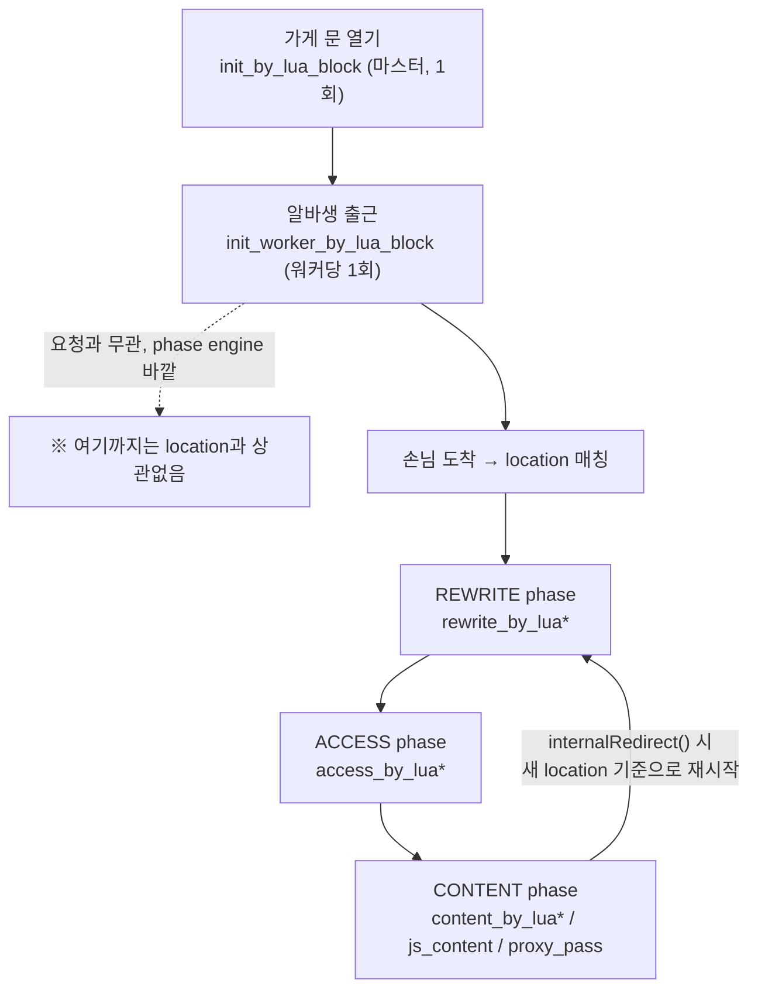

# nginx/OpenResty의 init phase, rewrite phase, content phase는 뭘로 구분하는 걸까?

> 참조: [Nginx/OpenResty Common Stories — innossh (Medium)](https://medium.com/@innossh/nginx-openresty-common-stories-a02207fcf492)

## 먼저 밝혀둘 것

참조해주신 Medium 글은 "Lua code execution order"라는 섹션에서 이 실행 순서를 다루긴 하는데, 직접 글로 풀어 쓴 게 아니라 **공식 저장소([openresty/lua-nginx-module](https://github.com/openresty/lua-nginx-module))의 phase 순서 다이어그램 이미지 한 장을 인용**하는 방식이에요. 그래서 이 답변은 그 글이 가리키는 원본 다이어그램(및 lua-nginx-module 공식 문서)을 근거로, 이 저장소의 `nginx/nginx.conf`·`nginx/default.conf`에 실제로 쓰인 지시어들을 예시 삼아 설명할게요.

## 결론부터

**"location / 에서 접근이 시작된다"는 절반만 맞아요.** init 계열(`init_by_lua*`, `init_worker_by_lua*`)은 애초에 **location이나 요청(request)과 아무 상관이 없는** 단계예요 — 손님(요청)이 문을 두드리기 전, 가게가 문을 여는 순간에 딱 한 번 실행돼요. 반면 rewrite phase·access phase·content phase는 손님이 어떤 location에 들어왔을 때만 실행되는, **nginx 코어가 못박아 둔 고정 순서(REWRITE → ACCESS → CONTENT)**의 세 단계예요. 그리고 이 세 단계 중 "지금 실행되는 게 어느 phase인지"는 위치(config에서 몇 번째 줄에 썼는지)가 아니라 **지시어 이름 자체**로 정해져요. `rewrite_by_lua*`라고 쓰면 무조건 REWRITE phase, `access_by_lua*`라고 쓰면 무조건 ACCESS phase, `content_by_lua*`(또는 njs의 `js_content`)라고 쓰면 무조건 CONTENT phase예요.

## 다섯 살에게 설명하듯

가게(nginx)를 하나 떠올려 보세요.

- **init(`init_by_lua_block`)** = 가게 **문을 열기 전**, 사장님이 아침에 혼자 재료를 미리 손질해두는 것. 손님은 아직 한 명도 안 왔어요. 손님이 몇 명이 오든, 어떤 메뉴를 시키든 상관없이 **딱 한 번**만 해요.
- **init_worker(`init_worker_by_lua_block`)** = 알바생(worker process)이 출근해서 자리에 앉는 순간 하는 일. 역시 손님이 오기 전, 알바생 한 명당 딱 한 번.
- **rewrite phase(`rewrite_by_lua*`)** = 손님이 문을 열고 들어온 직후, 안내 데스크에서 "아 이 손님은 사실 저쪽 메뉴판을 봐야 하네" 하고 **주문서 자체를 슬쩍 바꿔주는 단계**(URI 재작성, 내부 목적지 변경).
- **access phase(`access_by_lua*`)** = 그 다음, "이 손님이 여기 들어올 자격이 있나?"를 검사하는 **문지기 단계**(인증, 한도 검사, 출입 허가/거부).
- **content phase(`content_by_lua*`, njs의 `js_content`, `proxy_pass`)** = 검사를 통과한 손님에게 **진짜 음식(응답)을 만들어 내주는 단계**.

같은 손님(요청) 하나가 이 셋을 거친다면 **순서는 절대 안 바뀌어요**: rewrite → access → content. 하지만 init/init_worker는 손님이랑 아예 상관없는, 가게 준비 단계라서 이 줄 세우기에 끼지도 않아요.

## 기술적으로 풀어보면

### 1. init/init_worker은 "phase engine 바깥"의 프로세스 생명주기 훅

`nginx/nginx.conf`의 `http {}` 블록을 보면:

```nginx
# nginx/nginx.conf (http 블록)
init_by_lua_block {
    require "resty.core"        # 마스터 프로세스가 설정을 읽을 때, 워커를 fork하기 전 딱 한 번
}

init_worker_by_lua_block {
    require("otel_child_spans").start_flush_timer()   # 각 워커가 뜬 직후, 워커당 한 번
}
```

이 두 지시어는 **어떤 `location {}` 안에도 안 들어있고, 들어갈 수도 없어요.** `http {}` 레벨에만 쓸 수 있는 지시어이기 때문이에요. 그래서 "location / 에서 시작된다"는 이야기 자체가 이 둘에는 적용이 안 돼요 — 요청 처리 phase engine(11단계)이 아예 가동되기 전에 이미 끝나 있는 일이에요.

- `init_by_lua*`: 설정 파일을 읽는 시점(설정 다시 읽기 `reload`도 포함) 한 번. 여기서 `require`한 모듈은 이후 모든 워커·모든 요청이 공유해요.
- `init_worker_by_lua*`: 워커 프로세스가 이벤트 루프를 시작하기 직전 한 번. 타이머 등록(`ngx.timer.every` 등)을 여기서 하는 이유가, 요청 하나하나마다 타이머를 새로 만들면 안 되기 때문이에요.

### 2. rewrite → access → content는 nginx 코어가 강제하는 고정 순서

nginx의 `ngx_http_core_module`은 요청 하나가 들어오면 11개 phase를 항상 같은 순서로 통과시켜요. 그 중 우리가 자주 만지는 세 개가 REWRITE, ACCESS, CONTENT예요. **"이 코드가 rewrite phase에서 도는지 content phase에서 도는지"는 config 파일에서 그 코드를 몇 번째 줄에 썼는지와 무관해요 — 오직 어떤 지시어를 썼는지로만 정해져요.**

| 쓴 지시어 | 실행되는 phase | 이 저장소에서의 실제 예시 |
|---|---|---|
| `rewrite_by_lua*` | REWRITE | (이 config엔 예시 없음 — 순수 `rewrite ... break;`만 사용) |
| `access_by_lua*` | ACCESS | `default.conf`의 `location @proxy_pass_backend` 안 `access_by_lua_block { vault_auth.enforce(); rate_limit.enforce() }` |
| `content_by_lua*` / njs `js_content` | CONTENT | `location /`의 `js_content router.route_check;`, gRPC transcode location의 `content_by_lua_block` |

즉 `access_by_lua_block`이라고 써놓으면, 그 블록이 파일 어디에 있든 **항상 ACCESS phase에서** 돌아요. rewrite phase가 다 끝나야 access phase가 시작되고, access phase가 다 끝나야(그리고 통과해야) content phase가 시작돼요. 이 순서를 코드로 바꿀 방법은 없어요 — 지시어를 바꿔서 다른 phase로 옮기는 것만 가능해요.

### 3. "location / 에서 시작된다"는 정확히 어떤 의미인가

요청이 `location /`에 매칭되면, 그 location 안에서 REWRITE → ACCESS → CONTENT를 순서대로 시도해요. 이 저장소의 `location /`는 REWRITE·ACCESS phase에는 Lua/njs 훅이 없고 곧바로 CONTENT phase의 `js_content router.route_check`로 넘어가요(`default.conf` 495~510번째 줄 주석에 그 이유가 적혀 있어요 — CORS·한도 판정에 필요한 "어느 메뉴로 가는 요청인지"를 이 시점엔 아직 몰라서예요).

그런데 `router.route_check`가 내부적으로 요청을 `@proxy_pass_backend`로 **내부 리다이렉트(internal redirect)** 시키면, nginx는 그 새 location 기준으로 **REWRITE→ACCESS→CONTENT phase 전체를 처음부터 다시 돌려요.** 그래서 `@proxy_pass_backend`도 자기만의 ACCESS phase(`access_by_lua_block`)를 갖는 거예요. 즉 "언제 실행되는가"는 (a) 어느 location에 들어와 있는가 + (b) 그 안에서 어떤 phase 지시어를 썼는가, 이 두 가지의 조합으로 정해지는 거지, "글에 먼저 쓰여 있으니까 먼저 실행된다" 같은 순서가 아니에요.

### 요약 그림



## 요약

| 구분 | 언제 실행되나 | location과의 관계 | 순서를 정하는 것 |
|---|---|---|---|
| `init_by_lua*` | 마스터가 설정 로드 시, 딱 1회 | 없음(phase engine 바깥, `http{}` 전용) | — |
| `init_worker_by_lua*` | 워커 시작 직후, 워커당 1회 | 없음(phase engine 바깥) | — |
| `rewrite_by_lua*` | 매 요청, REWRITE phase | 매칭된 location 안에서 | **지시어 이름**(위치 무관) |
| `access_by_lua*` | 매 요청, ACCESS phase | 매칭된 location 안에서 | **지시어 이름**(위치 무관) |
| `content_by_lua*` / `js_content` | 매 요청, CONTENT phase | 매칭된 location 안에서 | **지시어 이름**(위치 무관) |
| 내부 리다이렉트 | CONTENT phase 도중 발생 가능 | 새 location 기준 REWRITE부터 재시작 | — |

Sources:
- [Nginx/OpenResty Common Stories — innossh (Medium)](https://medium.com/@innossh/nginx-openresty-common-stories-a02207fcf492) (요청하신 참조 사이트 — "Lua code execution order" 섹션에서 아래 공식 저장소의 phase 순서 다이어그램을 인용함)
- [openresty/lua-nginx-module (GitHub)](https://github.com/openresty/lua-nginx-module) — 위 Medium 글이 인용한 phase 실행 순서 다이어그램의 원본
- [OpenResty - Lua Nginx Module 공식 문서](https://openresty.org/en/lua-nginx-module.html)
- 이 저장소 내 관련 상세 답변: [`nginx-openresty-njs-request-processing-phases.md`](./nginx-openresty-njs-request-processing-phases.md) (11개 phase 전체 표, njs 훅까지 포함한 더 넓은 설명)
