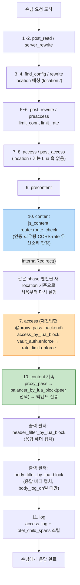

# nginx의 요청 처리 단계(phase)는 뭐고, OpenResty(Lua)·njs는 거기에 어떻게 끼어드는 걸까?

## 결론부터

nginx는 손님(요청) 하나가 들어오면 **정해진 순서의 검문소(phase) 11개**를 무조건 차례로 통과시켜요. OpenResty의 `*_by_lua*` 지시어들과 njs의 `js_*` 지시어들은 **새 검문소를 만드는 게 아니라, 이미 있는 검문소 자리에 우리 코드를 꽂아 넣는 것**뿐이에요. 그래서 "이 코드가 언제 실행되는가"는 결국 "이 지시어가 어느 phase에 꽂히는가"로 정해집니다. `nginx/default.conf`에 있는 `access_by_lua_block`이 `location /`가 아니라 `@proxy_pass_backend`에 있는 이유, `balancer_by_lua_block`이 `header_filter_by_lua_block`보다 먼저 도는 이유가 전부 이 순서 때문이에요.

## 다섯 살에게 설명하듯

큰 건물(nginx)에 손님이 들어오면 문에서부터 출구까지 **정해진 순서의 검문소**를 하나씩 지나가야 해요: 신분증 확인 → 출입증 도장 → 안내데스크 → 물건 받기 → 나가면서 기록 남기기, 이런 식으로요. 검문소 순서는 절대 안 바뀌어요.

`access_by_lua*`, `content_by_lua*` 같은 지시어는 "몇 번째 검문소에서 이 도장(우리 코드)을 찍어줘"라고 미리 부탁해두는 거예요. 그런데 재밌는 건, 안내데스크(content phase)에서 "어, 이 손님은 3층 사무실로 가야 하네" 하고 **손님을 새 목적지로 다시 보내면(internal redirect)**, 그 손님은 처음 문(신분증 확인 검문소)부터는 아니고 **새 목적지 기준으로 다시 검문소들을 지나가요.** 그래서 이 게이트웨이는 일부러 인증·한도 검사 도장을 "재배정 후 목적지"의 검문소에 찍도록 설계했어요 — 그래야 "어느 메뉴로 가는 손님인지"를 알고 나서 검사할 수 있으니까요.

## 기술적으로 풀어보면

### nginx 핵심 11단계(phase engine)

nginx 소스코드(`ngx_http_core_module`)에 박혀 있는 요청 처리 순서예요. 이건 OpenResty나 njs를 안 써도 nginx라면 항상 이 순서를 따릅니다.

| # | phase(내부 이름) | 하는 일 | 이 config에서 실제로 쓰는 예 |
|---|---|---|---|
| 1 | `POST_READ` | 요청 헤더를 다 읽은 직후 | (직접 안 씀) |
| 2 | `SERVER_REWRITE` | `server{}` 레벨의 `rewrite` | (직접 안 씀) |
| 3 | `FIND_CONFIG` | URI로 어느 `location{}`인지 찾기(내부용) | `location /`, `location @proxy_pass_backend` 등 매칭 |
| 4 | `REWRITE` | `location{}` 레벨의 `rewrite`, `set_by_lua*` | `/internal/grpc_transcode_upstream`의 `rewrite ... break;` |
| 5 | `POST_REWRITE` | rewrite 반복(내부용) | (직접 안 씀) |
| 6 | `PREACCESS` | 본격 인증 전 사전 검사 | `limit_conn`, `limit_rate` |
| 7 | `ACCESS` | 출입 허용/거부 판정, `access_by_lua*` | `allow/deny`(관리자 IP), `@proxy_pass_backend`의 `access_by_lua_block`(vault_auth, rate_limit) |
| 8 | `POST_ACCESS` | `satisfy any/all` 처리(내부용) | (직접 안 씀) |
| 9 | `PRECONTENT` | 본문 만들기 직전(예: `try_files`) | (직접 안 씀) |
| 10 | `CONTENT` | **진짜 응답을 만드는 단계** | `js_content router.route_check`, `proxy_pass`, `content_by_lua_block`(grpc_transcode) |
| 11 | `LOG` | 손님에게 다 보낸 뒤 로그 기록 | `access_log`, `log_by_lua*`(otel 자식 스팬 조립) |

### phase 엔진 "밖"에 있는 특별한 훅

이 11단계와 별개로, **요청 하나하나가 아니라 nginx 프로세스 생명주기에 걸리는** OpenResty 훅들도 있어요(이 config에는 안 보이지만 `nginx.conf`에 있을 수 있음):

- `init_by_lua*` — 마스터 프로세스가 설정을 읽을 때(워커를 fork하기 전) **딱 한 번**.
- `init_worker_by_lua*` — 각 워커가 뜬 직후 **워커당 한 번**.
- `exit_worker_by_lua*` — 워커가 죽기 직전.
- `ssl_certificate_by_lua*` — TLS 핸드셰이크 도중, **phase 엔진이 시작되기도 전**.
- `balancer_by_lua*` — 정확히는 CONTENT phase 안에서 `proxy_pass`가 업스트림에 연결을 붙이려는 순간(피어 선택). 11단계 목록엔 없지만 사실상 "content phase의 연장"이에요. 이 config의 `dynamic_backend` upstream이 여기서 실제 백엔드 IP를 정합니다.
- `header_filter_by_lua*` / `body_filter_by_lua*` — CONTENT phase가 응답을 만들고 **나가는 길목(출력 필터 체인)**에서 헤더/바디를 가로챕니다. LOG phase보다 먼저지만 11단계 번호표엔 안 끼어 있어요.

### njs(`ngx_http_js_module`)의 훅

njs는 OpenResty(Lua)보다 꽂을 수 있는 자리가 적어요:

- `js_content` → CONTENT phase 핸들러(이 게이트웨이의 `router.route_check`가 여기).
- `js_access` → ACCESS phase 핸들러(있지만 이 config는 안 씀 — 라우팅 판정 자체가 CONTENT phase에서만 가능해서, 대신 vault_auth/rate_limit을 Lua로 뒤 location의 ACCESS phase에 걸었다).
- `js_header_filter` / `js_body_filter` → 출력 필터 체인(응답 헤더/바디 가로채기).
- `js_preread` → **stream(TCP/UDP)** 모듈 전용, HTTP엔 없음.

### 왜 이 게이트웨이가 이렇게 설계됐는가 (phase 순서로 설명)

1. `location /`의 CONTENT phase에서 `js_content router.route_check`가 돈다 → 여기서 인증·부서·메뉴를 전부 판정하고 `internalRedirect()`로 `@proxy_pass_backend`(또는 `@transcode_grpc_backend`)로 손님을 다시 보낸다.
2. **internal redirect는 그 목적지 location 기준으로 phase 엔진을 처음부터 다시 돌린다.** 그래서 `@proxy_pass_backend`도 자기만의 ACCESS phase를 가진다 — 거기에 `access_by_lua_block { vault_auth.enforce(); rate_limit.enforce() }`를 걸어뒀다. `location /`의 ACCESS phase에 걸면 아직 "어느 메뉴인지" 모르는 시점이라 못 거는 것.
3. 같은 CONTENT phase 안에서 `proxy_pass`가 업스트림에 연결을 붙이려는 순간 `balancer_by_lua_block`이 진짜 백엔드 IP를 고른다.
4. 백엔드가 응답을 주면 CONTENT phase가 끝나고 출력 필터 체인(`header_filter_by_lua_block` → `body_filter_by_lua_block`)을 거쳐 손님에게 나간다.
5. 다 보낸 뒤 LOG phase에서 `otel_child_spans.conf`가 자식 스팬(rate_limit/routing_auth/backend_select)을 조립해 내보낸다 — 그래서 이 조립 작업은 손님이 기다리는 시간에 영향을 안 준다.

### 전체 흐름 다이어그램

## 요약

| 구분 | phase 엔진과의 관계 | 대표 지시어 |
|---|---|---|
| nginx core 11단계 | 모든 요청이 항상 통과 | `rewrite`, `allow/deny`, `limit_conn`, `proxy_pass` |
| OpenResty(Lua) `*_by_lua*` | 11단계 중 특정 지점에 코드 삽입 | `access_by_lua*`, `content_by_lua*`, `log_by_lua*` |
| `balancer_by_lua*` | content phase 안, 업스트림 연결 직전 | 실제 백엔드 IP 선택 |
| `header_filter_by_lua*` / `body_filter_by_lua*` | content phase 이후 출력 필터 체인 | 응답 캡처 |
| njs `js_*` | Lua보다 적은 자리(content/access/필터)만 지원 | `js_content`, `js_access`, `js_header_filter` |
| 프로세스 생명주기 훅 | 요청과 무관, 마스터/워커 시작·종료 시 | `init_by_lua*`, `init_worker_by_lua*` |
| internal redirect | 새 location 기준으로 phase 엔진 재시작 | `r.internalRedirect()`, `error_page = @named` |

Sources:
- [OpenResty - Lua Nginx Module](https://openresty.org/en/lua-nginx-module.html)
- [lua-nginx-module/doc/HttpLuaModule.wiki (GitHub)](https://github.com/openresty/lua-nginx-module/blob/master/doc/HttpLuaModule.wiki)
- [Module ngx_http_js_module (nginx.org)](https://nginx.org/en/docs/http/ngx_http_js_module.html)
- [NGINX HTTP Request Stages (Gist)](https://gist.github.com/denji/9130d1c95e350c58bc50e4b3a9e29bf4)
- [HTTP request processing phases in Nginx - Nginx Guts](https://www.nginxguts.com/2011/01/phases.html)
