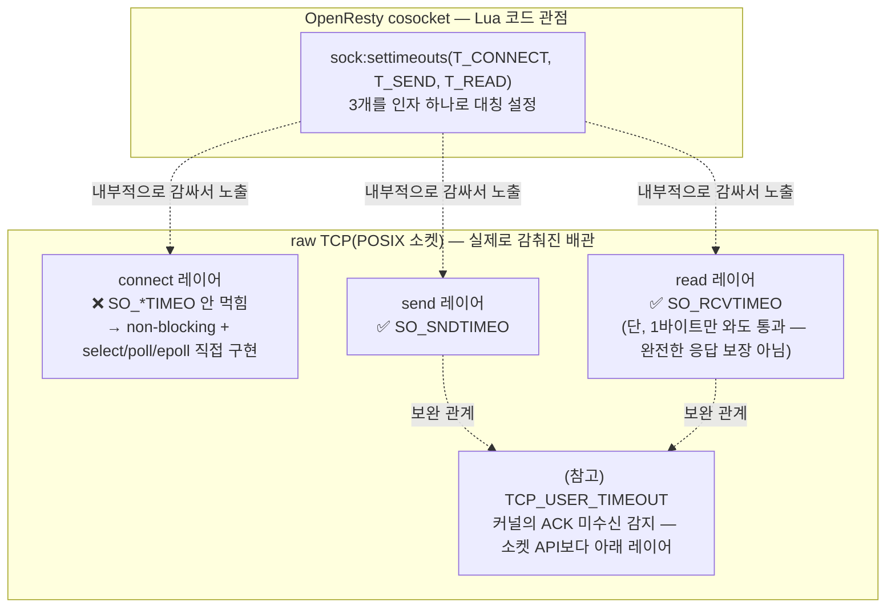

# TCP에서의 connect, send, read도 (OpenResty cosocket과) 같은 구조임?

## 결론부터

**"3개의 서로 다른 지점에서 따로 기다린다"는 원리는 완전히 같아요.** 하지만 **"그 3개를 하나의 깔끔한 API로 설정할 수 있는가"는 완전히 달라요.** OpenResty의 `sock:settimeouts(connect, send, read)`는 세 인자를 한 줄에 나란히 넣으면 끝이지만, raw TCP(POSIX 소켓 API, 즉 C의 `connect()`/`send()`/`recv()`)에서는 **connect 하나만 유독 다른 방식으로 손수 구현**해야 해요. send/read 둘은 소켓 옵션(`SO_SNDTIMEO`/`SO_RCVTIMEO`)으로 깔끔하게 되는데, connect는 그 옵션이 아예 안 먹혀요. 즉 OpenResty가 "3개 다 똑같이 인자 하나로 설정하면 돼요"라고 보여준 매끈함은, **cosocket이 이 raw API의 울퉁불퉁함을 내부에서 대신 감싸준 결과**예요.

## 다섯 살에게 설명하듯

앞의 답변에서 "초인종 누르기(connect) → 쪽지 건네기(send) → 답 기다리기(read)"라는 3단계 비유를 썼었죠. 이번엔 그 3단계를 **누가 초시계를 손에 쥐어주는지**로 비교해볼게요.

- OpenResty(cosocket)에서는 가게 사장님(nginx)이 세 단계 모두에 **"몇 초까지만 기다려" 스티커**를 미리 붙여줘요. 하나의 함수 호출로 끝.
- raw TCP(운영체제 기본 소켓)에서는 사장님이 **"쪽지 건네기"랑 "답 기다리기"에는 스티커를 붙여줄 수 있는데(`SO_SNDTIMEO`, `SO_RCVTIMEO`), "초인종 누르고 문 열리길 기다리기"엔 스티커 붙이는 기능 자체가 없어요.** 그래서 개발자가 직접 "문이 안 열리면 몇 초 뒤에 포기"하는 알람시계를 손수 만들어 달아야 해요(non-blocking + `select`/`poll`/`epoll`로 직접 구현).

## 기술적으로 풀어보면

### 1. send/read는 소켓 옵션으로 대응된다 — 하지만 의미가 살짝 다르다

POSIX 소켓에는 `SO_SNDTIMEO`, `SO_RCVTIMEO`라는 옵션이 있고, 이건 각각 `send()`/`recv()` 호출이 **블로킹 상태로 얼마나 기다릴지**를 정해요.

```c
struct timeval tv = { .tv_sec = 0, .tv_usec = 200000 }; // 200ms
setsockopt(fd, SOL_SOCKET, SO_SNDTIMEO, &tv, sizeof(tv)); // T_SEND와 대응
setsockopt(fd, SOL_SOCKET, SO_RCVTIMEO, &tv2, sizeof(tv2)); // T_READ와 대응
```

동작 방식이 OpenResty의 `send_timeout`/`read_timeout`과 원리상 같아요 — **각자 독립적으로 리셋되는 개별 타임아웃**이라는 점도 동일해요. 다만 미묘한 차이가 하나 있어요: `SO_SNDTIMEO`/`SO_RCVTIMEO`는 "**단 1바이트라도 오갔으면** 타임아웃으로 안 침"이라는 규칙이 있어요. 즉 대량의 데이터를 나눠 받는 도중 한 조각이라도 들어오면 시계가 리셋되듯 통과돼서, "총 응답 하나를 받는 데 걸리는 진짜 왕복 시간"을 보장하진 않아요. (OpenResty cosocket의 `read_timeout`도 이 커널 옵션 위에서 동작하는 거라 근본적으로 같은 특성을 가져요.)

### 2. connect만 소켓 옵션으로 안 된다 — 별도 구현이 필요하다

`SO_SNDTIMEO`/`SO_RCVTIMEO`는 **`connect()`에는 적용되지 않아요.** `connect()`를 블로킹 모드로 그냥 호출하면, 상대가 응답이 없을 경우 OS의 TCP 재전송(SYN 재시도) 로직에 맡겨져 **수십 초 단위**로 걸릴 수 있어요. 그래서 connect에 원하는 타임아웃을 걸려면 다음 패턴을 직접 짜야 해요:

```c
fcntl(fd, F_SETFL, O_NONBLOCK);         // 논블로킹으로 전환
int rc = connect(fd, addr, addrlen);     // 즉시 EINPROGRESS 리턴하고 안 기다림
// ... select()/poll()/epoll_wait()로 "쓰기 가능(writable)" 이벤트를 T_CONNECT ms만 기다림
// 이벤트가 오면 getsockopt(SO_ERROR)로 실제 연결 성공/실패 확인
```

이게 바로 OpenResty cosocket이 내부적으로 하는 일이에요. 이전 답변에서 설명한 "코루틴이 yield하고 nginx 이벤트 루프에 등록됐다가 resume된다"는 게, 사실 이 non-blocking connect + epoll 대기 패턴을 **Lua 코드 입장에선 안 보이게 감싼 것**이에요. `sock:connect()` 한 줄 뒤에 이 모든 select/epoll 배관이 숨어있는 거죠.

### 3. 그래서 "구조가 같냐"는 질문에 대한 정확한 답

| 관점 | 같은가? |
|---|---|
| "connect, send, read라는 **3개의 독립된 대기 지점**이 있고, 각자 타임아웃을 따로 매길 수 있다" | ✅ **같음** — 이게 이전 답변의 핵심 구조였고, raw TCP도 원리는 동일 |
| "한 지점이 시간을 다 써도 다른 지점 예산은 안 깎인다(초시계가 각자 리셋)" | ✅ **같음** |
| "이 3개를 API 하나(`settimeouts(a,b,c)`)로 대칭적으로 설정한다" | ❌ **다름** — raw TCP는 send/read만 대칭(소켓 옵션), connect는 비대칭(non-blocking+select 손수 구현) |
| "타임아웃이 '응답 도달'까지 보장한다" | ❌ **둘 다 아님** — 아래 4번 참고 |

### 4. 덤: "받았다"와 "상대가 확실히 받았다"는 다른 문제

`SO_SNDTIMEO`가 다 통과했다고 해서 **상대방이 실제로 그 데이터를 받았다는 보장은 없어요** — 그건 "내 커널 버퍼에 쓰기를 마쳤다"는 뜻이지 "상대가 ACK 했다"는 뜻이 아니에요. 이 "보낸 데이터가 계속 확인응답(ACK) 없이 떠 있는 상태"를 감지하려면 Linux에서는 `TCP_USER_TIMEOUT`이라는 **커널 레벨 옵션**을 따로 써야 해요. 이건 OpenResty의 3-레이어 비유엔 없는, **소켓 API보다 한 층 더 아래(커널의 재전송 로직)에 있는 4번째 축**이라고 보면 돼요. (참고로 OpenResty cosocket은 이 옵션까지 노출하진 않아요.)

## 요약 그림



## 요약

- **원리(3개의 독립된 대기 지점, 각자 리셋되는 타임아웃)는 raw TCP와 OpenResty cosocket이 동일**해요.
- **API의 매끈함은 다름**: send/read는 raw TCP도 소켓 옵션 하나로 대칭적으로 설정되지만, connect는 raw TCP에서 예외적으로 손수 non-blocking+select/epoll 패턴을 짜야 해요. OpenResty의 `settimeouts(a,b,c)`가 3개를 똑같이 대칭으로 보여주는 건, 이 connect의 울퉁불퉁함을 cosocket이 내부에서 흡수해준 덕분이에요.
- send/read 타임아웃 둘 다 "상대가 실제로 받았다/응답을 완성했다"까지는 보장 못 하고, 그 문제는 `TCP_USER_TIMEOUT` 같은 더 아래 레이어의 커널 메커니즘이 다뤄요.

Sources:
- [How to Handle TCP Connection Timeouts in C Socket Code — oneuptime.com](https://oneuptime.com/blog/post/2026-03-20-tcp-connection-timeout-c/view)
- [socket(7) — Linux manual page](https://man7.org/linux/man-pages/man7/socket.7.html)
- [Sending and Receiving Timeouts with SO_RCVTIMEO and SO_SNDTIMEO — nanovms.com](https://nanovms.com/changelog/sending-receiving-timeouts-so_rcvtimeo-so_sndtimeo)
- [tcp_user_timeout — Kernel-enforced socket deadlines on Linux via TCP_USER_TIMEOUT (GitHub)](https://github.com/rubymonolith/tcp_user_timeout)
- 이 저장소 내 관련 답변: [`vault-tcp-cosocket-connect-send-read-timeout-layers.md`](./vault-tcp-cosocket-connect-send-read-timeout-layers.md) (OpenResty cosocket의 connect/send/read 3-레이어 원본 설명)
