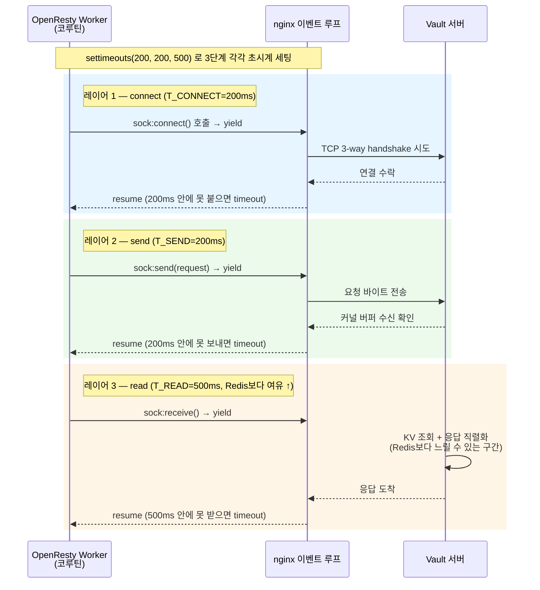

# Vault용 tcpsock 타임아웃, connect/send/read 3개 레이어를 그림으로 설명해줘

## 결론부터

이 코드의 `T_CONNECT`/`T_SEND`/`T_READ`는 **하나의 Vault 요청 안에서 벌어지는 3번의 서로 다른 네트워크 I/O 단계마다 따로 매겨진 독립적인 제한시간**이에요. OpenResty의 cosocket API(`ngx.socket.tcp()`)가 내부적으로 `connect()` → `send()` → `receive()`라는 3단계를 거치는데, `tcpsock:settimeouts(connect_timeout, send_timeout, read_timeout)`가 그 3단계 각각에 별도의 초시계를 채워주는 거예요. **세 시계는 서로 이어 붙는 게 아니라 각자 리셋돼요** — connect가 199ms 걸려도 send는 다시 200ms 꽉 채워 쓸 수 있어요. 그리고 `read`만 500ms로 더 긴 이유는, Vault가 Redis처럼 "메모리 값 하나 반환"이 아니라 **KV 스토리지 조회 + 응답 직렬화**라는 추가 작업을 서버 쪽에서 하기 때문에, 같은 왕복이라도 응답을 "기다리는" 구간이 구조적으로 더 오래 걸릴 수 있다는 뜻이에요.

## 다섯 살에게 설명하듯

친구 집에 가서 숙제(비밀 질문)를 물어보는 상황을 떠올려 보세요.

- **connect (T_CONNECT, 200ms)** = 친구 집 **초인종을 누르고 문이 열리길 기다리는 시간**. 이 시간 안에 문이 안 열리면 "집에 없나 보다" 하고 포기해요. (`sock:connect(host, port)`)
- **send (T_SEND, 200ms)** = 문이 열린 다음, **내가 질문 쪽지를 친구 손에 건네는 시간**. 쪽지 한 장 건네는 거라 오래 안 걸려요. (`sock:send(request)`)
- **read (T_READ, 500ms)** = 쪽지를 건넨 뒤 **친구가 답을 찾아서 말해줄 때까지 기다리는 시간**. 이번 친구(Vault)는 답을 알려면 방(KV 저장소)에 들어가서 서랍을 뒤져(조회) 종이에 옮겨 적어야(직렬화) 해서, 답을 바로 아는 다른 친구(Redis, rate_limit.lua)보다 기다리는 시간을 더 넉넉히 줘요.

셋 다 "총 몇 초 안에 전체를 끝내라"가 아니라, **각 단계마다 따로따로 재는 초시계**라는 게 핵심이에요.

## 기술적으로 풀어보면

### 1. cosocket의 3단계와 `settimeouts`의 인자 순서가 정확히 대응한다

OpenResty의 cosocket(`ngx.socket.tcp()`)은 Lua 코루틴을 nginx의 이벤트 루프 위에 얹어 non-blocking I/O를 흉내내는 방식이에요. 네트워크 I/O가 발생하는 시점마다 코루틴이 **yield**해서 nginx 이벤트 리스너에 자신을 등록하고, 해당 이벤트(연결 완료, 전송 완료, 데이터 도착)가 발생하면 nginx가 그 코루틴을 다시 **resume**시켜요. 이 구조상 "기다림"이 발생하는 지점이 정확히 3곳이고, 각 지점마다 독립적인 타임아웃을 걸 수 있어요.

```lua
sock:settimeouts(T_CONNECT, T_SEND, T_READ)
-- 인자 순서 = connect_timeout, send_timeout, read_timeout (단위: ms)

local ok, err = sock:connect(vault_host, vault_port)   -- ① yield/resume 지점 1: T_CONNECT 적용
if not ok then return nil, "connect: " .. err end

local bytes, err = sock:send(request_bytes)            -- ② yield/resume 지점 2: T_SEND 적용
if not bytes then return nil, "send: " .. err end

local body, err = sock:receive("*a")                   -- ③ yield/resume 지점 3: T_READ 적용
if not body then return nil, "read: " .. err end
```

- 예전 API인 `sock:settimeout(ms)`는 세 단계에 **같은 값 하나**를 적용하는 축약형이고, `settimeouts(a, b, c)`는 이 코드처럼 단계별로 다르게 줄 때 써요.
- 이 값들은 nginx 코어 레벨의 `lua_socket_connect_timeout`/`lua_socket_send_timeout`/`lua_socket_read_timeout` 지시어의 **기본값을 요청/코루틴 단위로 덮어쓰는 것**이라, "이 Vault 호출만 read를 500ms로" 같은 국소적 조정이 가능해요.

### 2. 왜 rate_limit.lua(Redis)는 200ms인데 이 코드(Vault)만 read가 500ms인가

- **Redis(`rate_limit.lua`)**: `INCR`/`GET` 같은 명령은 서버가 인메모리 값을 그대로 돌려주는 O(1) 연산이라, "연결 맺기"나 "요청 보내기"와 응답 대기 시간이 크게 다르지 않아요. 그래서 connect/send/read를 같은 200ms로 맞춰도 무리가 없어요.
- **Vault**: 요청을 받은 Vault 서버는 (a) 스토리지 백엔드(파일/Consul/DB 등)에서 KV를 조회하고, (b) 그 결과를 정책 검사·복호화까지 거쳐 JSON으로 직렬화한 뒤에야 응답을 내려줘요. 이 (a)+(b)가 Redis의 단순 조회보다 구조적으로 느릴 수 있는 작업이라, **read 구간만** 여유를 더 준 거예요. connect/send는 "TCP 3-way handshake"와 "요청 바이트 밀어넣기"라 백엔드 종류와 무관하게 비슷하게 빠르므로 그대로 200ms를 재사용한 거고요.

### 3. 왜 이걸 하나로 합쳐서 "총 900ms"로 안 하는가

만약 `settimeout(900)` 하나로 뭉쳤다면, 예를 들어 connect가 이례적으로 850ms 걸려 붙었을 때 send/read에 쓸 시간이 50ms밖에 안 남는 등 **한 단계의 지연이 다른 단계의 예산을 깎아먹는 문제**가 생겨요. 단계별로 나누면 "connect는 정상적으로 빨리 끝났는데 read만 유독 느리다"처럼 **어느 구간에서 지연이 생겼는지 원인 구분이 명확**해지고, 장애 시 에러 메시지(`"connect: timeout"` vs `"read: timeout"`)로 바로 원인 위치를 알 수 있어요.

## 요약 그림



세 레이어는 그림처럼 **직렬로 이어지지만 초시계는 각자 따로** 돌아요. 레이어 1(connect)이 199ms를 다 쓰고 겨우 통과해도, 레이어 2(send)는 자기 몫의 200ms를 새로 온전히 받아요.

## 요약 표

| 레이어 | 지시어 인자 위치 | 대응 cosocket 호출 | 이 코드의 값 | rate_limit.lua(Redis) | 왜 다른가 |
|---|---|---|---|---|---|
| ① connect | `settimeouts`의 1번째 | `sock:connect()` | 200ms | 200ms(동일) | TCP handshake는 백엔드 종류와 무관하게 비슷 |
| ② send | `settimeouts`의 2번째 | `sock:send()` | 200ms | 200ms(동일) | 요청 바이트 전송도 백엔드 종류와 무관하게 비슷 |
| ③ read | `settimeouts`의 3번째 | `sock:receive()` | 500ms | (Redis 기준 더 짧음) | Vault는 KV 조회 + 응답 직렬화가 추가로 필요해 왕복이 더 걸릴 수 있음 |

Sources:
- [The core of OpenResty: cosocket — API7.ai](https://api7.ai/learning-center/openresty/the-core-of-openresty-cosocket)
- [lua-nginx-module — tcpsock:settimeouts 관련 이슈 및 테스트 (openresty/lua-nginx-module, GitHub)](https://github.com/openresty/lua-nginx-module/blob/master/t/065-tcp-socket-timeout.t)
- [OpenResty - Lua Nginx Module 공식 문서](https://openresty.org/en/lua-nginx-module.html)
- 이 저장소 내 관련 답변: [`nginx-lua-init-rewrite-content-phase-distinction.md`](./nginx-lua-init-rewrite-content-phase-distinction.md) (같은 `default.conf`에서 `vault_auth.enforce()`/`rate_limit.enforce()`가 access phase에서 호출되는 맥락)
